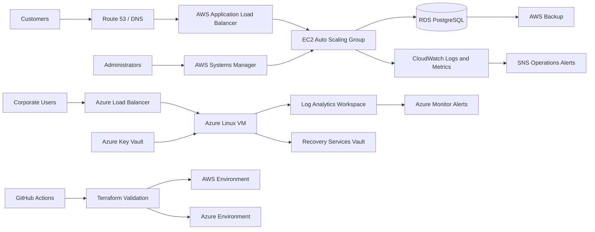

# Cloud Infrastructure Operations Lab

Production-inspired AWS and Microsoft Azure operations portfolio for **Northstar Retail**, built to demonstrate junior Cloud Operations, Infrastructure Support, Cloud Support, and DevOps responsibilities.

## What this project proves

- Infrastructure as Code for AWS and Azure
- Highly available network and compute design
- Centralized monitoring, alerting, logging, and backup controls
- Repeatable Linux configuration with Ansible
- Kubernetes deployment, health checks, scaling, and disruption protection
- Incident response, root-cause analysis, change control, tickets, runbooks, and evidence
- Security controls including least privilege, encryption, private subnets, secret handling, and audit logging
- CI checks for Terraform, YAML, Python, shell, and Markdown

## Business scenario

Northstar Retail operates a customer-order API in AWS and internal operations services in Azure. The cloud operations team supports availability, backup validation, patching, incident response, cost control, access governance, and infrastructure changes.

## Architecture

## Repository map

| Directory | Purpose |
|---|---|
| `terraform/aws` | AWS VPC, ALB, Auto Scaling, RDS, CloudWatch, SNS, S3 logs, backup, IAM |
| `terraform/azure` | Azure VNet, NSG, VM, Log Analytics, alerts, Key Vault, backup vault |
| `ansible` | Idempotent Linux hardening and application configuration |
| `kubernetes` | Namespace, deployment, service, HPA, PDB, network policy |
| `monitoring` | Prometheus rules and dashboard definitions |
| `scripts` | Operational Bash, PowerShell, and Python automation |
| `runbooks` | Service-specific diagnosis, recovery, escalation, and validation procedures |
| `incident-response` | Completed incident records and root-cause analyses |
| `change-management` | Approved change records with implementation and rollback plans |
| `tickets` | Realistic resolved support and operations tickets |
| `evidence` | Sanitized lab outputs demonstrating validation and operational execution |
| `datasets` | Clearly labeled synthetic operations datasets |

## Deployment sequence

1. Install Terraform 1.7+, AWS CLI, Azure CLI, Ansible, Python 3.11+, and kubectl.
2. Authenticate to AWS and Azure using short-lived credentials.
3. Run `./scripts/validate-repository.sh`.
4. Deploy AWS with `terraform -chdir=terraform/aws init && terraform -chdir=terraform/aws apply`.
5. Deploy Azure with `terraform -chdir=terraform/azure init && terraform -chdir=terraform/azure apply`.
6. Configure Linux hosts with `ansible-playbook -i ansible/inventory.ini ansible/site.yml`.
7. Deploy Kubernetes resources with `kubectl apply -k kubernetes/overlays/production`.
8. Run backup and monitoring validation scripts.

## Security and cost safeguards

- No credentials or private keys are committed.
- Sensitive values are generated or injected at deployment time.
- Database and application instances reside in private subnets.
- Administrative access uses Systems Manager or Azure Bastion-compatible patterns rather than public SSH.
- Encryption is enabled for storage, logs, database, backups, and Key Vault.
- Default instance sizes are intentionally small for lab use.
- Destroy environments after validation to prevent unintended charges.

## Evidence statement

Files under `evidence/` are sanitized lab validation records. Datasets are explicitly synthetic and exist to demonstrate operational analysis, not to imply employment history or production access.

## Portfolio outcomes

This project provides interview-ready examples for troubleshooting high CPU, failed backups, unhealthy load-balancer targets, database connection exhaustion, certificate expiry, Kubernetes rollout failure, IAM access review, patch compliance, disaster recovery, and post-incident improvement.

**Author:** Jamie Christian II
