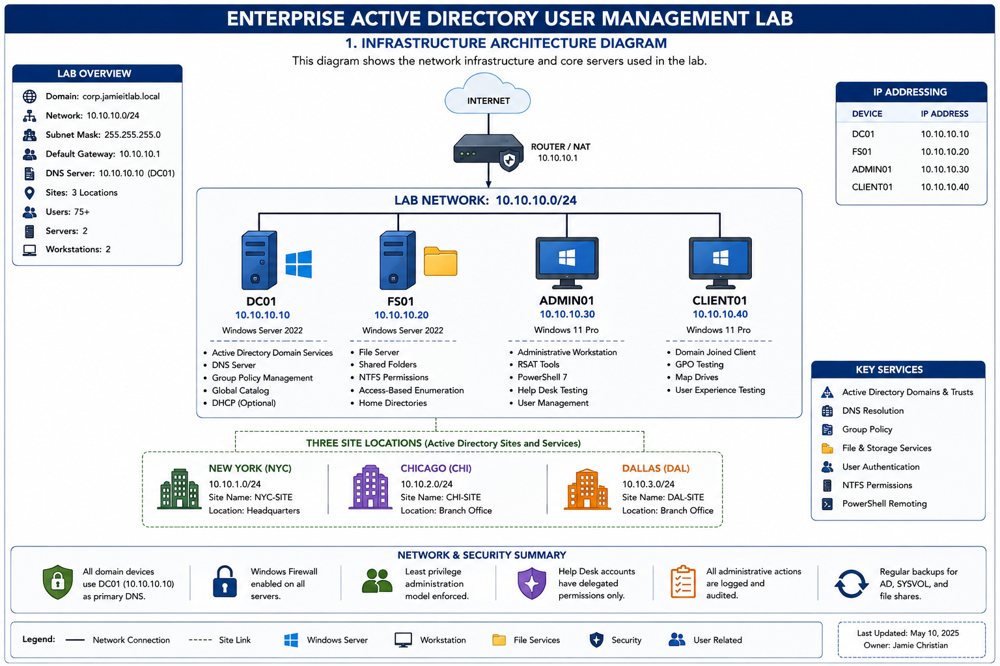
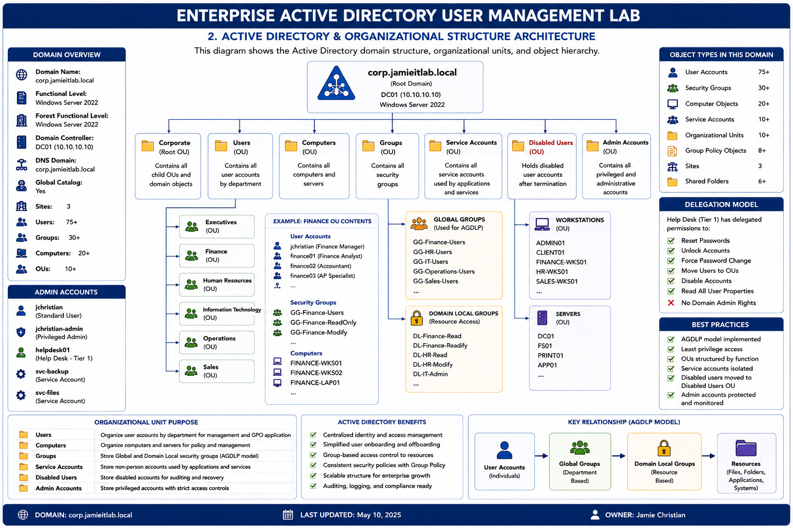
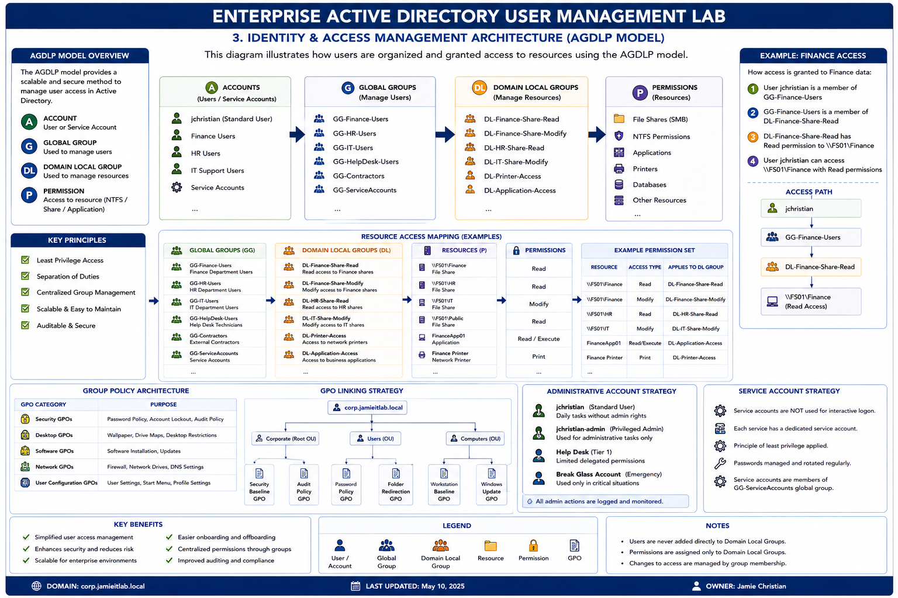
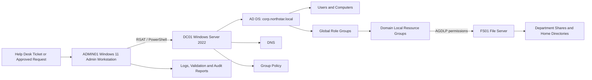

[README.md](https://github.com/user-attachments/files/30755245/README.md)
# Enterprise Active Directory User Management Lab

**Portfolio Owner:** Jamie Christian  
**Fictional Organization:** Northstar Logistics Group  
**Environment:** Windows Server 2022, Windows 11, Active Directory Domain Services, DNS, Group Policy, File Services, RSAT, and PowerShell  
**Domain:** `corp.northstar.local`

> A job-ready enterprise IT operations project demonstrating identity lifecycle management, role-based access control, Group Policy, file permissions, PowerShell automation, Help Desk ticket resolution, auditing, and operational documentation for a simulated 75-user organization.

## Project at a Glance

| Metric | Result |
|---|---:|
| Simulated users | 75 |
| Departments | 5 |
| Office locations | 3 |
| Domain controllers | 1 |
| File servers | 1 |
| Administrative/client workstations | 2 |
| PowerShell scripts | 17 |
| Resolved tickets | 20 |
| Knowledge-base articles | 5 |
| Architecture diagrams | 3 |
| Group Policy Objects | 8+ |
| Shared-folder resources | 6+ |

## Executive Summary

This project simulates the day-to-day work of a Tier 1/Tier 2 IT Support Technician or Junior Systems Administrator supporting Northstar Logistics Group. It covers the full identity lifecycle: onboarding, access changes, password resets, account unlocks, security groups, shared folders, NTFS permissions, Group Policy, department transfers, leave, termination, rehire, auditing, ticket resolution, and knowledge-base documentation.

The repository is designed to be reviewed without screenshots. Every major task is supported by implementation guides, production-style PowerShell, configuration data, change records, sample evidence, resolved tickets, validation controls, rollback planning, and expected outcomes.

## Business Scenario

Northstar Logistics Group is opening a new regional office. IT must standardize user provisioning, reduce access mistakes, enforce least privilege, improve onboarding and offboarding, and document common support procedures.

The lab supports five departments:

- Information Technology
- Human Resources
- Finance
- Operations
- Sales

## Architecture

### 1. Enterprise Infrastructure Architecture



**Purpose:** Shows the lab network, DC01, FS01, administrative workstation, domain-joined client, IP addressing, core Windows services, and security controls.

### 2. Active Directory Organizational Structure



**Purpose:** Shows the `corp.northstar.local` domain hierarchy, department OUs, computer and server organization, service accounts, disabled accounts, administrative accounts, and delegated Help Desk access.

### 3. Identity and Access Management — AGDLP



**Purpose:** Shows how user accounts are placed into department Global Groups, nested into Domain Local resource groups, and granted permissions to file shares, printers, and applications.

## Technical Architecture



## What This Project Demonstrates

- Active Directory domain and Organizational Unit design
- Active Directory Users and Computers administration
- New-hire onboarding and employee offboarding
- Password resets and account unlocks
- Department transfers, promotions, leave, termination, and rehire
- Role-based security groups and AGDLP access control
- Shared folders, share permissions, and NTFS permissions
- Group Policy configuration, linking, testing, backup, and rollback
- Delegated Tier 1 administration without Domain Admin rights
- 75-user bulk provisioning across three office locations
- PowerShell automation with validation, logging, and safe execution controls
- Account lifecycle and effective-access auditing
- Help Desk ticket ownership, troubleshooting, and resolution documentation
- Internal knowledge-base authoring
- Change control, security controls, disaster recovery, and rollback planning

## Repository Map

| Folder/File | Purpose |
|---|---|
| `architecture/` | Infrastructure, OU, IAM, access-control, and service-design documentation |
| `config/` | Approved user, group, share, and role-mapping input data |
| `docs/` | Build guide, runbook, Group Policy implementation, security controls, testing, recovery, and interview preparation |
| `scripts/` | Reusable PowerShell administration and audit scripts |
| `tickets/` | 20 fully resolved service requests, incidents, changes, and security tickets |
| `knowledge-base/` | 5 internal support articles for recurring identity and access issues |
| `evidence/` | Clearly labeled sample logs, reports, test results, and change records |
| `templates/` | Reusable operational templates |
| `FILE-INVENTORY.json` | File inventory and project integrity reference |
| `LICENSE` | Repository license |

## Core Deliverables

1. **Structured Active Directory** — Department OUs, users, workstations, servers, groups, service accounts, privileged accounts, and disabled identities.
2. **Automated onboarding** — Creates users, assigns attributes and role groups, creates home directories, and records activity.
3. **Automated offboarding** — Disables accounts, exports memberships, removes access, moves accounts, and preserves evidence.
4. **Role-based access model** — Global groups are nested into Domain Local resource groups; permissions are assigned to resource groups rather than individual users.
5. **File services** — Department shares, home directories, access-based enumeration, and NTFS/share permission controls.
6. **Group Policy** — Password and lockout controls, workstation security, drive mapping, screen lock, Windows Update, audit logging, and endpoint restrictions.
7. **Delegated administration** — Tier 1 Help Desk staff can reset passwords, unlock accounts, force password changes, and perform approved lifecycle actions without Domain Admin membership.
8. **Operational records** — 20 tickets, 5 KB articles, change records, validation tests, audit reports, and disaster-recovery documentation.

## PowerShell Automation

The project contains 17 scripts covering:

- Environment prerequisite validation
- OU structure deployment
- Security-group creation
- Bulk user provisioning from CSV
- Department-share creation
- Password resets and account unlocks
- New-hire onboarding
- Employee offboarding
- Department transfers and role changes
- Leave-of-absence account suspension
- Rehire processing
- Home-directory creation
- Active Directory audit reporting
- Effective-access review
- GPO backup
- Delegated Help Desk permission validation
- Full lab-state validation

### Script safety controls

- `Set-StrictMode` and terminating error handling
- Input validation before changes are applied
- `-WhatIf` support or explicit confirmation for destructive operations
- No temporary passwords written to logs
- Membership export before offboarding changes
- Timestamped logs and validation output
- Group-based access instead of direct user permissions
- Expected-state validation after changes

## Identity and Access Model

The project uses an AGDLP-style access model:

```text
Accounts → Global Groups → Domain Local Groups → Permissions
```

Example:

```text
jchristian
  ↓
GG-Finance-Users
  ↓
DL-Finance-Share-Modify
  ↓
\\FS01\Finance — Modify
```

This approach centralizes access management, improves auditability, simplifies transfers and offboarding, and avoids direct user permissions.

## Group Policy Coverage

The implementation includes policies for:

- Domain password and account lockout requirements
- Workstation security baseline
- Department drive mappings
- Screen-lock enforcement
- Windows Update configuration
- Audit policy and event logging
- Removable-storage restrictions
- Tier 1 Help Desk restrictions

Default domain policies are not overloaded with unrelated workstation settings. Policies are separated by function and linked to the appropriate OUs.

## Help Desk Ticket Portfolio

The `tickets/` folder contains **20 fully resolved records** covering:

- Password resets
- Account unlocks
- New-hire onboarding
- Employee offboarding
- Department transfers
- Group membership changes
- Shared-folder access failures
- Drive-mapping issues
- Permission validation
- Group Policy troubleshooting
- Delegated administration testing
- Security and audit requests
- Backup and recovery changes

Each ticket documents the request or incident, business impact, troubleshooting or implementation steps, validation, resolution, and closure notes.

## Knowledge Base

The project includes five internal articles:

- Resetting an Active Directory password
- Unlocking a user account
- Requesting access to a shared folder
- New-hire onboarding process
- Offboarding and account-disable process

## Evidence Classification

The `evidence/` folder contains **sample lab evidence** designed to demonstrate expected outputs and documentation standards. Evidence is labeled so reviewers can distinguish between:

- Configuration inputs
- Expected-state examples
- Sample logs and reports
- Validation results
- Change-control records
- Audit artifacts

Production claims are intentionally avoided; this is a controlled portfolio lab using fictional users and organizational data.

## Quick Start

1. Read `docs/01-lab-build-guide.md`.
2. Build the Windows Server and Windows 11 lab environment.
3. Configure all domain-joined machines to use DC01 for DNS.
4. Run `scripts/00-PrerequisiteCheck.ps1` as an authorized administrator.
5. Run `scripts/01-Build-OU-Structure.ps1`.
6. Run `scripts/02-New-ADSecurityGroups.ps1`.
7. Run `scripts/03-New-BulkADUsers.ps1`.
8. Configure shares using `scripts/04-New-DepartmentShares.ps1`.
9. Implement policies using `docs/04-group-policy-implementation.md`.
10. Validate the environment using `scripts/09-Invoke-LabValidation.ps1`.
11. Generate an audit report using `scripts/10-Export-ADAuditReport.ps1`.

> Run all scripts in a disposable lab first. Review variables, paths, OUs, and domain values before execution.

## Validation and Completion Standard

The project is considered complete when:

- Required OUs and groups exist
- The 75-user dataset provisions successfully
- Department access follows the approved group model
- No users have direct NTFS permissions
- Delegated Help Desk actions succeed without Domain Admin rights
- GPOs apply to their intended targets
- Onboarding and offboarding workflows complete successfully
- Audit and access-review reports generate correctly
- All controls in `docs/06-test-plan-and-results.md` pass
- `evidence/reports/lab-validation-results.csv` contains no failed required controls

## Security and Governance Controls

- Least-privilege access
- Separate standard and privileged administrator accounts
- No routine use of Enterprise Admin privileges
- Delegated Help Desk permissions scoped to approved OUs
- Service accounts isolated and prohibited from interactive sign-in
- Direct user permissions prohibited
- Administrative actions logged and reviewed
- Account lifecycle activity documented
- GPOs backed up before major changes
- Rollback procedures documented
- System State and file-server recovery procedures documented

## Interview Talking Points

- “I designed a department-based OU structure that separates users, workstations, servers, groups, service accounts, privileged accounts, and disabled identities.”
- “I used an AGDLP-style model so users join Global role groups, which are nested into Domain Local resource groups that receive permissions.”
- “I automated onboarding and offboarding with input validation, activity logging, membership exports, rollback-aware steps, and post-change validation.”
- “I documented **20 realistic tickets** and wrote five knowledge-base articles for common identity and access issues.”
- “I delegated Tier 1 password and account support without assigning Domain Admin rights.”
- “I treated the lab like a controlled enterprise change by including testing, change management, security controls, auditing, backup, and recovery procedures.”

## Resume Bullet

> Built an enterprise Active Directory lab for a simulated 75-user logistics organization, automating onboarding/offboarding, password and lockout support, role-based AGDLP access, shared-folder permissions, Group Policy baselines, and audit reporting with PowerShell; documented 20 resolved tickets and five support knowledge-base articles.

## Skills Demonstrated

`Active Directory` · `AD DS` · `ADUC` · `Windows Server 2022` · `Windows 11` · `DNS` · `Group Policy` · `PowerShell` · `RSAT` · `NTFS Permissions` · `File Services` · `AGDLP` · `RBAC` · `Identity Lifecycle Management` · `Help Desk` · `Ticketing` · `Troubleshooting` · `Auditing` · `Change Management` · `Disaster Recovery` · `Technical Documentation`

## Disclaimer

All organizations, users, tickets, IP addresses, and operational records in this repository are fictional and created for educational and portfolio purposes. No production credentials or private company data are included.
