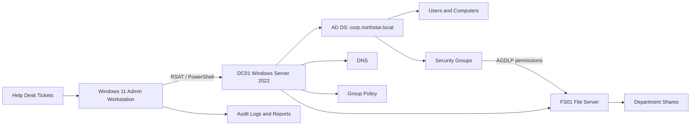

# Enterprise Active Directory User Management Lab

**Portfolio owner:** Jamie Christian  
**Environment:** Windows Server 2022, Windows 11, Active Directory Domain Services, DNS, Group Policy, PowerShell  
**Fictional organization:** Northstar Logistics Group  
**Domain:** `corp.northstar.local`

## Executive Summary

This project simulates the day-to-day work of a Tier 1/Tier 2 IT Support Technician or Junior Systems Administrator supporting a 75-user organization. It covers the full identity lifecycle: onboarding, access changes, password resets, account unlocks, security groups, shared folders, NTFS permissions, Group Policy, offboarding, auditing, ticket resolution, and knowledge-base documentation.

The repository is designed to be reviewed without screenshots. Every task is supported by implementation guides, production-style PowerShell, change records, sample evidence, resolved tickets, controls, and expected outcomes.

## Business Scenario

Northstar Logistics Group is opening a new regional office. IT must standardize user provisioning, reduce access mistakes, enforce least privilege, improve offboarding, and document common support procedures. The lab implements a repeatable identity and access management process for five departments:

- Information Technology
- Human Resources
- Finance
- Operations
- Sales

## What This Project Demonstrates

- Active Directory domain and OU design
- User onboarding and offboarding
- Password resets and account unlocks
- AD Users and Computers administration
- Role-based security groups
- AGDLP-style access control
- Shared folders and NTFS permissions
- Group Policy configuration
- Delegated Tier 1 administration without Domain Admin rights
- Department transfer, promotion, leave, termination, and rehire workflows
- 75-user bulk provisioning dataset across three offices
- GPO backup, rollback, and disaster-recovery procedures
- PowerShell automation with logging and validation
- Account lifecycle audits
- Ticket ownership and resolution notes
- Knowledge-base authoring
- Change control, rollback planning, and security documentation

## Repository Map

| Folder | Purpose |
|---|---|
| `architecture/` | Logical design, OU model, access-control model, and data flow |
| `config/` | Approved input data for users, groups, shares, and role mappings |
| `docs/` | Build guide, runbook, security controls, testing, and interview guide |
| `scripts/` | Safe, reusable PowerShell administration scripts |
| `tickets/` | Twenty fully resolved, realistic service tickets |
| `knowledge-base/` | Internal support articles for recurring issues |
| `evidence/` | Sample logs, reports, test results, and change records |
| `templates/` | Reusable operational templates |

## Target Architecture

## Core Deliverables

1. **Structured Active Directory:** Department OUs, users, workstations, servers, groups, and disabled accounts.
2. **Automated onboarding:** Creates the user, sets attributes, assigns role groups, creates a home directory, and records activity.
3. **Automated offboarding:** Disables access, removes group memberships, moves the account, records memberships, and preserves evidence.
4. **Access model:** Department global groups nested into domain-local resource groups, with permissions assigned only to resource groups.
5. **Group Policy:** Password/lockout controls, workstation baseline, mapped drives, screen lock, and removable-storage restrictions.
6. **Operational records:** Twenty tickets, five KB articles, change records, test cases, and audit reports.

## Quick Start

1. Read `docs/01-lab-build-guide.md`.
2. Build the two-server/one-client environment.
3. Run `scripts/00-PrerequisiteCheck.ps1` as a domain administrator.
4. Run `scripts/01-Build-OU-Structure.ps1`.
5. Run `scripts/02-New-ADSecurityGroups.ps1`.
6. Run `scripts/03-New-BulkADUsers.ps1`.
7. Configure file shares with `scripts/04-New-DepartmentShares.ps1`.
8. Link policies using `docs/04-group-policy-implementation.md`.
9. Validate using `scripts/09-Invoke-LabValidation.ps1`.
10. Generate an audit using `scripts/10-Export-ADAuditReport.ps1`.

## Safety and Quality Controls

- Scripts use `Set-StrictMode` and terminating error handling.
- Destructive operations support `-WhatIf` or require an explicit confirmation switch.
- Temporary passwords are never written to logs.
- Offboarding exports group membership before removal.
- Access is assigned to groups, not directly to individuals.
- Every script writes timestamped logs.
- Validation checks confirm the intended state.

## Portfolio Talking Points

- “I designed a department-based OU structure and separated users, workstations, servers, groups, service accounts, and disabled identities.”
- “I used an AGDLP-style model so user accounts join global role groups, which are nested into domain-local resource groups that receive NTFS permissions.”
- “I automated onboarding and offboarding with input validation, logging, rollback-aware steps, and audit evidence.”
- “I documented fifteen realistic tickets and wrote KB articles for common identity and access issues.”
- “I treated the lab like a production change by including testing, change control, security controls, and a recovery plan.”

## Resume Bullet

> Built an enterprise Active Directory lab for a 75-user logistics company, automating user onboarding/offboarding, password and lockout support, role-based group access, shared-folder permissions, Group Policy baselines, and audit reporting with PowerShell; documented 20 resolved tickets and 5 support knowledge-base articles.

## Completion Standard

The project is complete when all tests in `docs/06-test-plan-and-results.md` pass and `evidence/reports/lab-validation-results.csv` shows no failed controls.

## Enterprise Enhancements

- `config/users-75.csv` supplies a complete 75-user population for bulk provisioning.
- Lifecycle scripts cover transfers, leave, and rehire in addition to onboarding and offboarding.
- Delegated administration documents a least-privilege Tier 1 support model.
- Effective-access review and GPO backup scripts add governance and recovery depth.
- Five additional tickets bring the case library to 20 resolved records.
