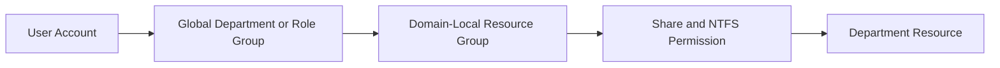

# Access Control Flow



## Example

```text
maya.patel
  -> GG-FIN-General
  -> DL-FS-Finance-RW
  -> Modify: \\FS01\Finance$
```

## Why This Matters

The business role and the technical permission remain separate. A user can change roles without editing file-system ACLs, and a resource can change servers without redesigning every business group.
