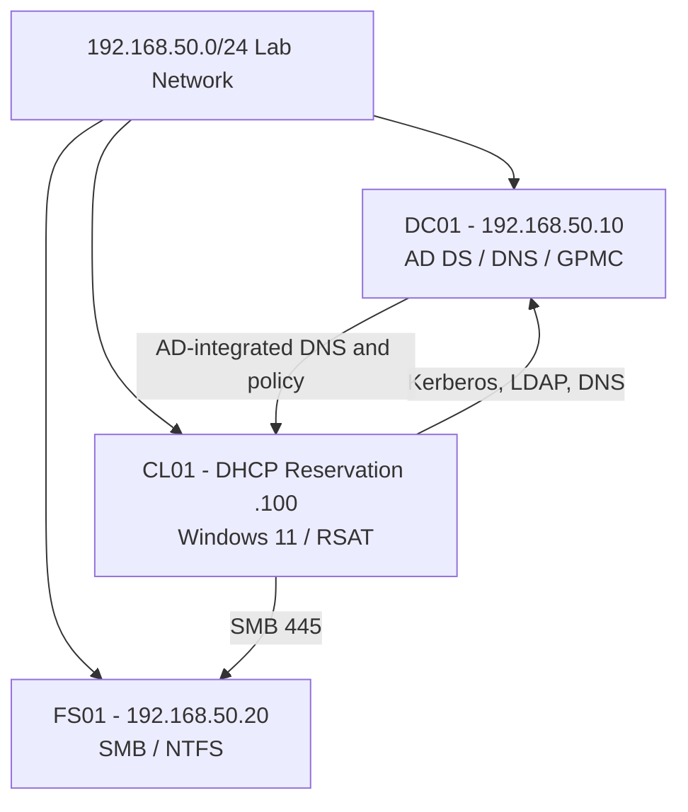

# Network and Service Design

All domain members use DC01 as their only DNS server. Administrative access is performed from CL01 using a separate admin credential. Department shares reside on FS01, while permissions are controlled by domain-local resource groups.
