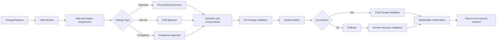

# 🔄 Enterprise Help Desk Change Management

> A complete, portfolio-ready change enablement package demonstrating how an IT support team plans, evaluates, approves, implements, validates, communicates, and closes controlled technology changes.

---

## 📌 Purpose

This folder demonstrates an enterprise-style change management process for a simulated Help Desk and IT Operations environment.

The process is designed to reduce service disruption, document accountability, provide clear rollback options, and confirm that every implemented change meets its intended business and technical outcomes.

---

## 🧭 Change Lifecycle

---

## 🗂️ Folder Contents

| File | Purpose |
|---|---|
| `change-template.md` | Reusable enterprise change record template |
| `change-policy.md` | Change types, roles, approval rules, and controls |
| `risk-assessment-matrix.md` | Standardized likelihood, impact, and risk scoring |
| `cab-operating-guide.md` | Change Advisory Board roles and meeting process |
| `pre-post-change-checklist.md` | Implementation readiness and validation checklist |
| `change-calendar.csv` | Scheduled and completed change calendar |
| `change-register.csv` | Portfolio-wide change tracking register |
| `CHG-2026-014-password-policy-update.md` | Completed normal change record |
| `CHG-2026-018-outlook-profile-repair-script.md` | Completed standard change record |
| `CHG-2026-021-vpn-dns-emergency-fix.md` | Completed emergency change record |
| `change-metrics-report.md` | KPI summary and management analysis |
| `communications/` | Stakeholder notification examples |

---

## 🧩 Change Types

| Type | Use Case | Approval |
|---|---|---|
| Standard | Low-risk, repeatable, documented, pre-authorized work | Service Owner |
| Normal | Planned work requiring risk review and scheduling | Change Manager and CAB |
| Emergency | Urgent work required to restore service or reduce immediate risk | Emergency Change Authority |

---

## 🎯 Control Objectives

- Every change has a business reason and accountable owner.
- Risk is assessed consistently before implementation.
- A tested rollback plan exists before work begins.
- Maintenance windows and user impact are communicated.
- Pre-change baselines and post-change results are recorded.
- Failed changes are recovered, reviewed, and documented.
- Closure requires validation evidence and outcome confirmation.

---

## 📊 Demonstrated Portfolio Outcomes

| Metric | Result |
|---|---:|
| Changes documented | 3 |
| Successful changes | 3 |
| Failed changes | 0 |
| Emergency changes | 1 |
| Changes with tested rollback plans | 100% |
| Changes with post-change validation | 100% |
| Changes closed with evidence | 100% |
| Simulated change success rate | 100% |

---

## 🧠 Skills Demonstrated

- Change enablement
- Risk and impact analysis
- CAB preparation
- Maintenance window planning
- Stakeholder communication
- Rollback planning
- Technical validation
- Audit-ready documentation
- Incident-to-change traceability
- Continual service improvement

---

## ⚠️ Disclaimer

All companies, users, systems, dates, metrics, and change records in this folder are simulated for educational and portfolio purposes. No production environment or confidential company data is represented.
