# 🚨 Enterprise Help Desk Incident Response

> A complete, portfolio-ready incident response package demonstrating detection, triage, escalation, containment, communication, recovery, root-cause analysis, and continual improvement in a simulated enterprise IT environment.

---

## 📌 Purpose

This folder demonstrates how an enterprise Help Desk and IT Operations team handles major and high-impact incidents from initial detection through closure.

The process emphasizes:

- Fast service restoration
- Clear ownership and escalation
- Accurate stakeholder communication
- Evidence-based troubleshooting
- Risk-controlled recovery
- Root-cause analysis
- Corrective action tracking
- Incident-to-change traceability

---

## 🔄 Incident Lifecycle

```mermaid
flowchart LR
    A[Detection] --> B[Ticket Creation]
    B --> C[Initial Triage]
    C --> D{Severity}
    D -->|P1/P2| E[Major Incident Declared]
    D -->|P3/P4| F[Standard Incident Handling]
    E --> G[Incident Commander Assigned]
    G --> H[Technical Teams Engaged]
    H --> I[Containment and Workaround]
    I --> J[Service Recovery]
    J --> K[Validation]
    K --> L[Stakeholder Resolution Notice]
    L --> M[Post-Incident Review]
    M --> N[Corrective Actions]
    N --> O[Problem or Change Record]
    O --> P[Closure]
```

---

## 🗂️ Folder Contents

| File | Purpose |
|---|---|
| `incident-response-policy.md` | Governance, ownership, and response requirements |
| `severity-priority-matrix.md` | P1–P4 classification criteria |
| `escalation-matrix.md` | Functional and management escalation paths |
| `major-incident-template.md` | Reusable major incident record |
| `incident-timeline-template.md` | Structured event timeline |
| `post-incident-review-template.md` | Reusable PIR and lessons-learned template |
| `INC-2026-104-vpn-dns-outage.md` | Completed P1 incident |
| `INC-2026-117-microsoft-365-mail-disruption.md` | Completed P2 incident |
| `INC-2026-123-active-directory-authentication-failure.md` | Completed P2 incident |
| `incident-metrics-report.md` | KPI and management analysis |
| `corrective-action-register.csv` | Tracked follow-up actions |
| `incident-register.csv` | Master incident tracking register |
| `communications/` | Initial, status, and resolution notices |

---

## 🎯 Response Objectives

| Priority | Acknowledge | Technical Engagement | Update Frequency | Restoration Target |
|---|---:|---:|---:|---:|
| P1 | 5 minutes | 10 minutes | Every 15 minutes | 2 hours |
| P2 | 15 minutes | 30 minutes | Every 30 minutes | 4 hours |
| P3 | 1 hour | 4 hours | As needed | 1 business day |
| P4 | 4 hours | 1 business day | As needed | 3 business days |

---

## 📊 Demonstrated Results

| Metric | Result |
|---|---:|
| Incidents documented | 3 |
| Major incidents | 3 |
| Incidents restored within target | 3 |
| Incidents with complete timelines | 100% |
| Incidents with user communications | 100% |
| Incidents with root-cause analysis | 100% |
| Incidents with corrective actions | 100% |
| Repeat incidents during review period | 0 |

---

## 🧠 Skills Demonstrated

- Incident command
- Major incident coordination
- Severity assessment
- Technical triage
- Escalation
- Containment
- Workaround design
- Service restoration
- Stakeholder communication
- Root-cause analysis
- Corrective action management
- Incident-to-change linkage
- Post-incident review

---

## ⚠️ Disclaimer

All companies, systems, users, dates, incidents, and metrics in this folder are simulated for educational and portfolio purposes.
