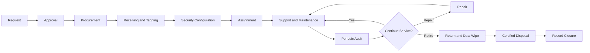

# Asset Lifecycle

## Lifecycle Controls

- Request and approval
- Purchase and receiving verification
- Asset tagging
- Baseline configuration
- Encryption and security validation
- Assignment documentation
- Maintenance and warranty tracking
- Quarterly physical audit
- Return and reassignment
- Data sanitization
- Certified recycling
- Financial and inventory closure
