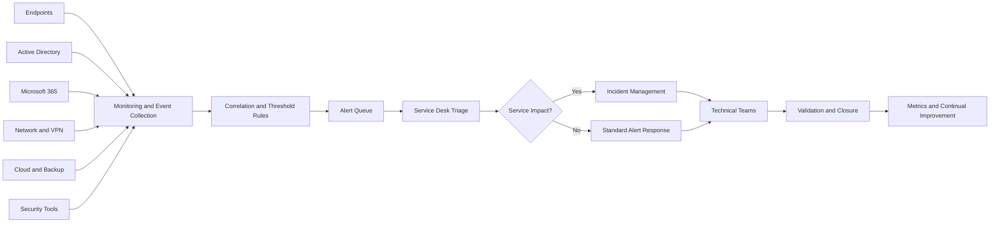

# Monitoring Architecture

## Coverage

- Endpoint availability, disk, encryption, and compliance
- Defender and security detections
- Active Directory lockouts and identity risk
- VPN authentication and DNS
- Microsoft 365 service health
- File share synthetic checks
- Print queue backlog
- Cloud backup failures
