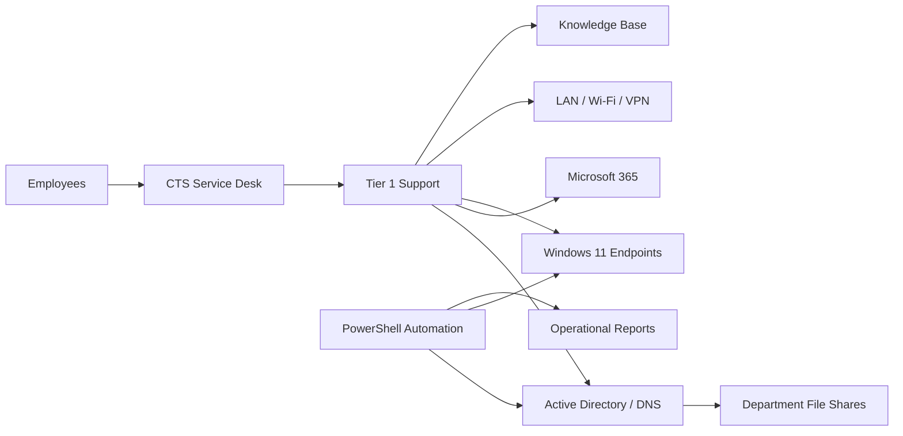

# Architecture Diagram

```mermaid
flowchart LR
U[Employees] --> Z[CTS Service Desk]
Z --> T1[Tier 1 Support]
T1 --> AD[Active Directory / DNS]
T1 --> M365[Microsoft 365]
T1 --> END[Windows 11 Endpoints]
T1 --> NET[LAN / Wi-Fi / VPN]
T1 --> KB[Knowledge Base]
AUTO[PowerShell Automation] --> AD
AUTO --> END
AUTO --> RPT[Operational Reports]
AD --> FS[Department File Shares]
```
