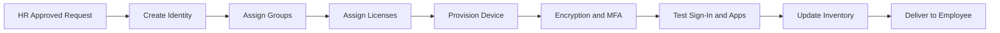

# Onboarding Flow

```mermaid
flowchart LR
HR[HR Approved Request] --> ID[Create Identity]
ID --> GRP[Assign Groups]
GRP --> LIC[Assign Licenses]
LIC --> DEV[Provision Device]
DEV --> SEC[Encryption and MFA]
SEC --> TEST[Test Sign-In and Apps]
TEST --> INV[Update Inventory]
INV --> DONE[Deliver to Employee]
```
