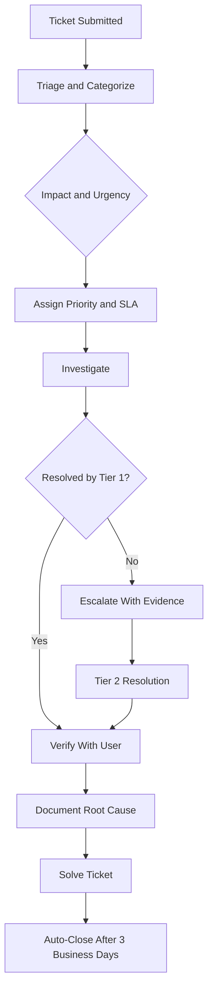

# Ticket Workflow

```mermaid
flowchart TD
A[Ticket Submitted] --> B[Triage and Categorize]
B --> C{Impact and Urgency}
C --> D[Assign Priority and SLA]
D --> E[Investigate]
E --> F{Resolved by Tier 1?}
F -- Yes --> G[Verify With User]
F -- No --> H[Escalate With Evidence]
H --> I[Tier 2 Resolution]
I --> G
G --> J[Document Root Cause]
J --> K[Solve Ticket]
K --> L[Auto-Close After 3 Business Days]
```
