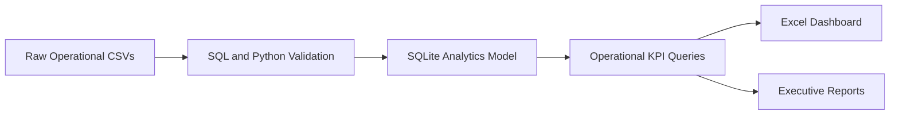

# 📊 Enterprise IT Operations Analytics


A production-style IT operations analytics project that converts service desk, patching, backup, cloud-cost, security, change, and incident data into validated KPIs, SQL analysis, an Excel dashboard, and executive recommendations.

## 🎯 Business Questions

- Are service desk SLAs being met?
- Which ticket categories require the most time?
- Is first-contact resolution improving?
- Are systems patched and backups successful?
- Is cloud cost growing?
- Are vulnerability and change risks controlled?
- How quickly are major incidents restored?

## 🧱 Analytics Workflow



## 📁 Project Structure

```text
analytics/
├── architecture/
├── data/
│   ├── raw/
│   └── processed/
├── dashboards/
├── documentation/
├── evidence/
├── python/
├── reports/
├── sql/
├── tests/
└── README.md
```

## 📈 Included KPIs

- Ticket volume
- Average resolution time
- First-contact resolution
- CSAT
- SLA attainment
- Patch compliance
- Backup success
- Cloud cost trend
- Open vulnerability findings
- Change success rate
- Major-incident MTTR
- Users impacted

## 🛠️ Tools

- SQL and SQLite
- Python
- Excel
- CSV and Markdown
- GitHub Actions

## 🚀 Run the Project

```bash
python3 python/validate_datasets.py
python3 tests/test_sql_queries.py
python3 python/generate_kpi_summary.py
python3 python/forecast_cloud_cost.py
```

## 📊 Dashboard

Open:

`dashboards/it-operations-analytics-dashboard.xlsx`

The workbook includes an executive dashboard and detailed data sheets for service desk, patch compliance, backups, cloud costs, vulnerabilities, and change records.

## ⚠️ Data Disclaimer

All data is synthetic and created for portfolio demonstration. It does not represent production systems, customers, or employees.
