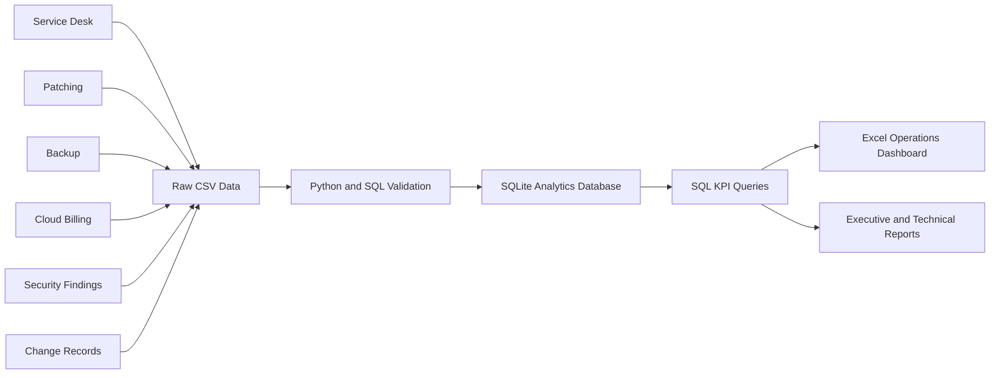

# IT Operations Analytics Data Flow

```mermaid
flowchart LR
    SD[Service Desk] --> RAW[Raw CSV Data]
    PATCH[Patching] --> RAW
    BACKUP[Backup] --> RAW
    CLOUD[Cloud Billing] --> RAW
    SEC[Security Findings] --> RAW
    CHG[Change Records] --> RAW
    RAW --> VALIDATE[Python and SQL Validation]
    VALIDATE --> DB[SQLite Analytics Database]
    DB --> SQL[SQL KPI Queries]
    SQL --> XLSX[Excel Operations Dashboard]
    SQL --> REPORTS[Executive and Technical Reports]
```
