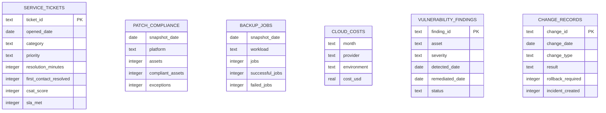

# Operations Analytics Data Model

```mermaid
erDiagram
    SERVICE_TICKETS {
        text ticket_id PK
        date opened_date
        text category
        text priority
        integer resolution_minutes
        integer first_contact_resolved
        integer csat_score
        integer sla_met
    }
    PATCH_COMPLIANCE {
        date snapshot_date
        text platform
        integer assets
        integer compliant_assets
        integer exceptions
    }
    BACKUP_JOBS {
        date snapshot_date
        text workload
        integer jobs
        integer successful_jobs
        integer failed_jobs
    }
    CLOUD_COSTS {
        text month
        text provider
        text environment
        real cost_usd
    }
    VULNERABILITY_FINDINGS {
        text finding_id PK
        text asset
        text severity
        date detected_date
        date remediated_date
        text status
    }
    CHANGE_RECORDS {
        text change_id PK
        date change_date
        text change_type
        text result
        integer rollback_required
        integer incident_created
    }
```
