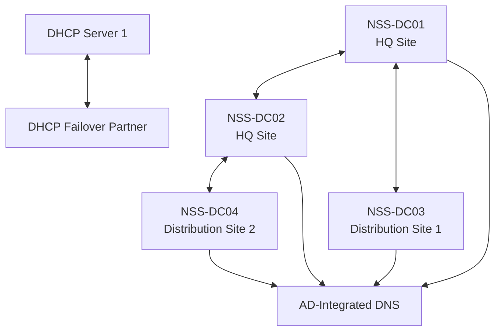

# Active Directory Topology

```mermaid
flowchart TB
    HQDC1[NSS-DC01<br/>HQ Site]
    HQDC2[NSS-DC02<br/>HQ Site]
    S1DC[NSS-DC03<br/>Distribution Site 1]
    S2DC[NSS-DC04<br/>Distribution Site 2]

    HQDC1 <--> HQDC2
    HQDC1 <--> S1DC
    HQDC2 <--> S2DC

    HQDC1 --> DNS[AD-Integrated DNS]
    HQDC2 --> DNS
    S1DC --> DNS
    S2DC --> DNS

    DHCP1[DHCP Server 1] <--> DHCP2[DHCP Failover Partner]
```
