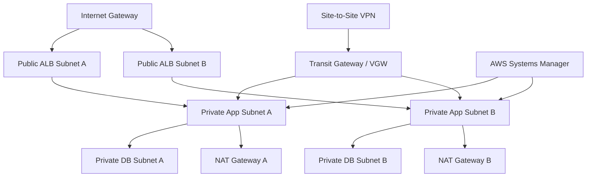

# AWS VPC Architecture

```mermaid
flowchart TB
    IGW[Internet Gateway] --> ALB1[Public ALB Subnet A]
    IGW --> ALB2[Public ALB Subnet B]
    ALB1 --> APP1[Private App Subnet A]
    ALB2 --> APP2[Private App Subnet B]
    APP1 --> DB1[Private DB Subnet A]
    APP2 --> DB2[Private DB Subnet B]
    APP1 --> NAT1[NAT Gateway A]
    APP2 --> NAT2[NAT Gateway B]
    VPN[Site-to-Site VPN] --> TGW[Transit Gateway / VGW]
    TGW --> APP1
    TGW --> APP2
    SSM[AWS Systems Manager] --> APP1
    SSM --> APP2
```
