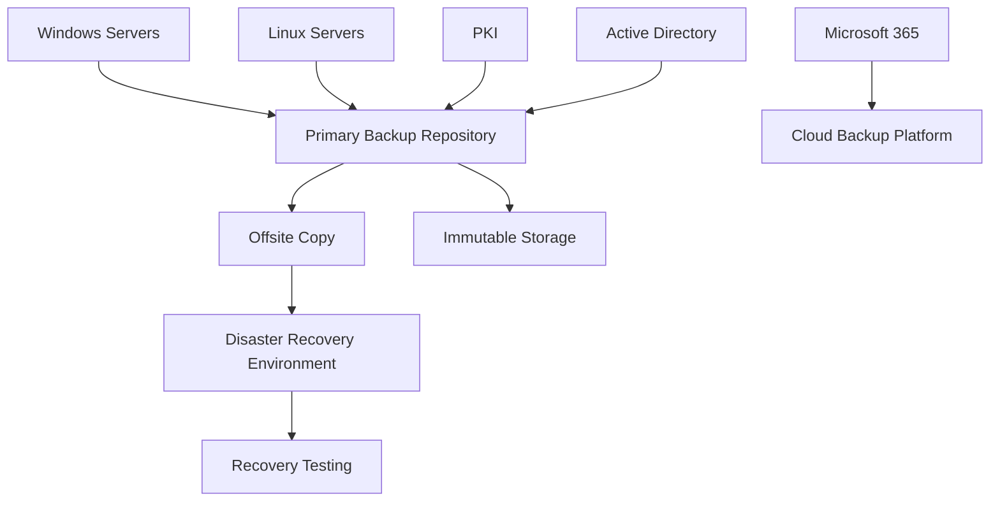

# Backup and Disaster Recovery Architecture

```mermaid
flowchart TB
    WIN[Windows Servers] --> REPO[Primary Backup Repository]
    LINUX[Linux Servers] --> REPO
    M365[Microsoft 365] --> CLOUD[Cloud Backup Platform]
    PKI[PKI] --> REPO
    AD[Active Directory] --> REPO
    REPO --> OFFSITE[Offsite Copy]
    REPO --> IMMUTABLE[Immutable Storage]
    OFFSITE --> DR[Disaster Recovery Environment]
    DR --> TEST[Recovery Testing]
```
