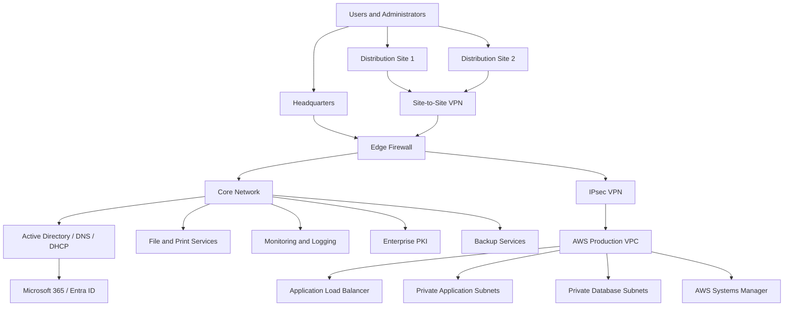

# Enterprise Hybrid Overview

```mermaid
flowchart TB
    USERS[Users and Administrators] --> HQ[Headquarters]
    USERS --> SITE1[Distribution Site 1]
    USERS --> SITE2[Distribution Site 2]

    HQ --> FW[Edge Firewall]
    SITE1 --> VPN[Site-to-Site VPN]
    SITE2 --> VPN
    VPN --> FW

    FW --> CORE[Core Network]
    CORE --> AD[Active Directory / DNS / DHCP]
    CORE --> FILE[File and Print Services]
    CORE --> MON[Monitoring and Logging]
    CORE --> PKI[Enterprise PKI]
    CORE --> BACKUP[Backup Services]

    FW --> AWSVPN[IPsec VPN]
    AWSVPN --> AWS[AWS Production VPC]

    AWS --> ALB[Application Load Balancer]
    AWS --> APP[Private Application Subnets]
    AWS --> DB[Private Database Subnets]
    AWS --> SSM[AWS Systems Manager]

    AD --> M365[Microsoft 365 / Entra ID]
```
