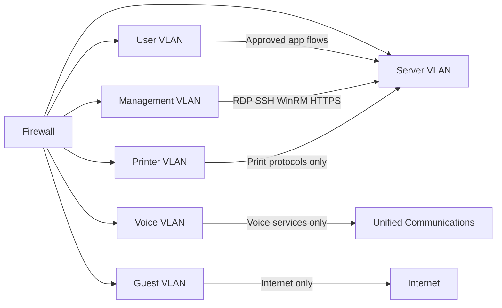

# Network Segmentation

## Segmentation Rules

- Management traffic originates only from the management VLAN.
- Guest access cannot reach internal networks.
- Printer VLAN access is restricted to print services.
- User VLANs cannot directly administer servers.
- East-west traffic is explicitly allowed, not assumed.
