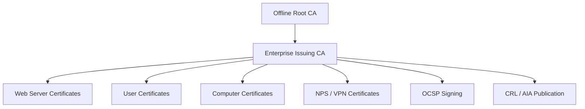

# PKI Trust Hierarchy

```mermaid
flowchart TB
    ROOT[Offline Root CA] --> ISSUE[Enterprise Issuing CA]
    ISSUE --> WEB[Web Server Certificates]
    ISSUE --> USER[User Certificates]
    ISSUE --> DEVICE[Computer Certificates]
    ISSUE --> NPS[NPS / VPN Certificates]
    ISSUE --> OCSP[OCSP Signing]
    ISSUE --> CRL[CRL / AIA Publication]
```
