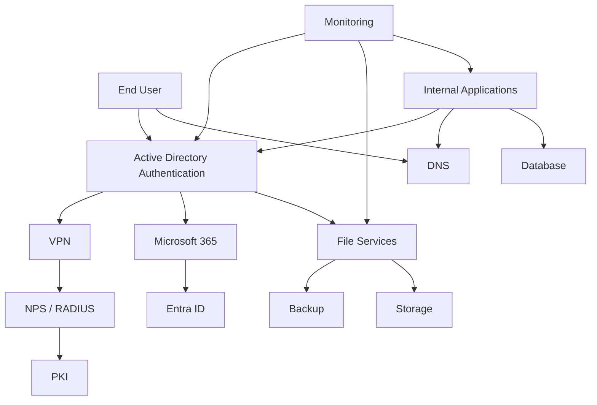

# Service Dependency Map

```mermaid
flowchart TB
    USER[End User] --> DNS[DNS]
    USER --> AUTH[Active Directory Authentication]
    AUTH --> FILE[File Services]
    AUTH --> M365[Microsoft 365]
    AUTH --> VPN[VPN]
    FILE --> STORAGE[Storage]
    FILE --> BACKUP[Backup]
    M365 --> ENTRA[Entra ID]
    VPN --> NPS[NPS / RADIUS]
    NPS --> PKI[PKI]
    APP[Internal Applications] --> DB[Database]
    APP --> DNS
    APP --> AUTH
    MON[Monitoring] --> APP
    MON --> FILE
    MON --> AUTH
```
