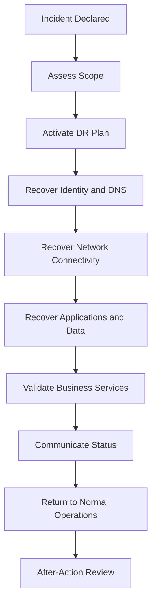

# Disaster Recovery Flow

```mermaid
flowchart TD
    A[Incident Declared] --> B[Assess Scope]
    B --> C[Activate DR Plan]
    C --> D[Recover Identity and DNS]
    D --> E[Recover Network Connectivity]
    E --> F[Recover Applications and Data]
    F --> G[Validate Business Services]
    G --> H[Communicate Status]
    H --> I[Return to Normal Operations]
    I --> J[After-Action Review]
```
