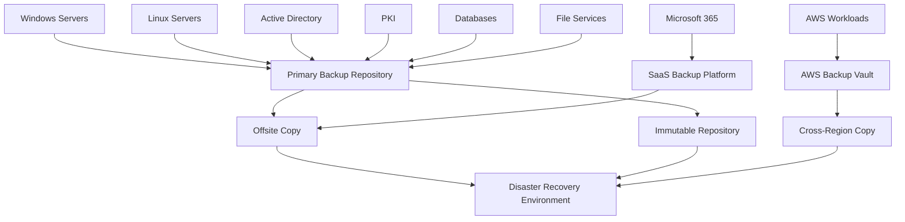

# Backup Architecture

```mermaid
flowchart TB
    WIN[Windows Servers] --> REPO[Primary Backup Repository]
    LINUX[Linux Servers] --> REPO
    AD[Active Directory] --> REPO
    PKI[PKI] --> REPO
    DB[Databases] --> REPO
    FILES[File Services] --> REPO

    M365[Microsoft 365] --> SAAS[SaaS Backup Platform]
    AWS[AWS Workloads] --> AWSB[AWS Backup Vault]

    REPO --> OFFSITE[Offsite Copy]
    REPO --> IMMUTABLE[Immutable Repository]
    SAAS --> OFFSITE
    AWSB --> CROSSREGION[Cross-Region Copy]

    OFFSITE --> DR[Disaster Recovery Environment]
    IMMUTABLE --> DR
    CROSSREGION --> DR
```
