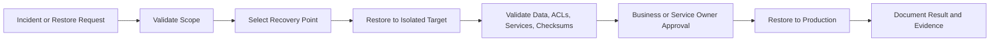

# Recovery Data Flow

```mermaid
flowchart LR
    INCIDENT[Incident or Restore Request] --> TRIAGE[Validate Scope]
    TRIAGE --> SOURCE[Select Recovery Point]
    SOURCE --> ISOLATED[Restore to Isolated Target]
    ISOLATED --> VALIDATE[Validate Data, ACLs, Services, Checksums]
    VALIDATE --> APPROVE[Business or Service Owner Approval]
    APPROVE --> PROD[Restore to Production]
    PROD --> RECORD[Document Result and Evidence]
```
