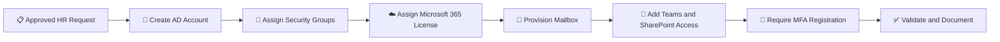
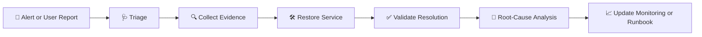
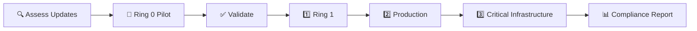

# 🏢 Enterprise Systems Administration Lab


A production-style enterprise systems administration portfolio demonstrating how Windows Server, Active Directory, Linux, Microsoft 365, identity, security, automation, monitoring, backup, patching, virtualization, and operational support work together in a realistic business environment.

> ⚠️ **Portfolio Disclaimer:** All organizations, domains, users, systems, incidents, tickets, reports, logs, and datasets in this lab are synthetic and created for educational and portfolio demonstration purposes. No confidential production information is included.

---

## 📌 Project Overview

Northstar Services is a simulated mid-sized organization operating a mixed Windows, Linux, Microsoft 365, cloud, and virtualization environment.

The infrastructure team supports:

* 🪟 Windows Server systems
* 🏢 Active Directory Domain Services
* 🌐 DNS and Group Policy
* ☁️ Microsoft 365 and Microsoft Entra ID
* 🐧 Linux application and utility servers
* 📁 File and print services
* 🔐 Enterprise PKI and certificate operations
* 🖥️ Virtualization platforms
* 📊 Monitoring and alerting
* 💾 Backup and disaster recovery
* 🔄 Patch and vulnerability management
* 🛡️ Security hardening and privileged access
* 🎫 Incident, request, and change management
* ⚙️ PowerShell, Bash, Python, Ansible, and DSC automation

The goal of this lab is to demonstrate practical systems administration skills through technical configurations, automation, documentation, operational records, troubleshooting scenarios, and validation evidence.

---

## 🎯 Target Roles

This project is designed to support applications for:

* Systems Administrator I
* Junior Systems Administrator
* Windows Server Administrator
* Linux Administrator I
* Infrastructure Support Engineer
* IT Operations Engineer
* IT Support Engineer I
* Technical Support Engineer
* Cloud Support Engineer
* Cloud Operations Analyst
* Junior DevOps Engineer
* Identity and Access Management Support
* Microsoft 365 Administrator
* Infrastructure Security Administrator

---

## 🏗️ Environment Architecture

```mermaid
flowchart TB
    USERS[👥 Employees and Administrators]

    USERS --> AD[🏢 Active Directory Domain Services]
    USERS --> M365[☁️ Microsoft 365 and Entra ID]

    AD --> DC1[🖥️ NSS-DC01]
    AD --> DC2[🖥️ NSS-DC02]
    AD --> GPO[📋 Group Policy]
    AD --> DNS[🌐 DNS Services]
    AD --> PKI[🔐 Enterprise PKI]

    M365 --> EXO[📧 Exchange Online]
    M365 --> TEAMS[💬 Microsoft Teams]
    M365 --> SPO[📁 SharePoint Online]
    M365 --> OD[☁️ OneDrive]

    WIN[🪟 Windows Servers] --> FILE[📂 File and Print Services]
    WIN --> APP[⚙️ Application Services]
    WIN --> BACKUP[💾 Backup Services]
    WIN --> PATCH[🔄 Patch Management]

    LINUX[🐧 Linux Servers] --> WEB[🌐 Application and Web Services]
    LINUX --> AUTO[🤖 Automation and Scheduled Jobs]

    HYP[🖥️ Virtualization] --> WIN
    HYP --> LINUX

    MON[📊 Prometheus and Grafana] --> WIN
    MON --> LINUX
    MON --> APP

    SEC[🛡️ Security Operations] --> AD
    SEC --> M365
    SEC --> WIN
    SEC --> LINUX
```



---

## 🖥️ Example Systems

| Hostname           | Platform            | Primary Role                             |
| ------------------ | ------------------- | ---------------------------------------- |
| `NSS-DC01`         | Windows Server 2022 | Primary domain controller and DNS        |
| `NSS-DC02`         | Windows Server 2022 | Secondary domain controller and DNS      |
| `NSS-FILE01`       | Windows Server 2022 | File services and FSRM                   |
| `NSS-PRINT01`      | Windows Server 2022 | Print services                           |
| `NSS-APP01`        | Windows Server 2022 | Internal application services            |
| `NSS-MON01`        | Linux               | Prometheus and Grafana monitoring        |
| `NSS-LINUX-APP01`  | Ubuntu Server       | Linux application services               |
| `NSS-LINUX-DB01`   | Rocky Linux         | Database services                        |
| `NSS-ROOT-CA01`    | Windows Server      | Offline Root Certificate Authority       |
| `NSS-ISSUING-CA01` | Windows Server      | Enterprise Issuing Certificate Authority |
| `NSS-ADM01`        | Windows 11          | Administrative workstation               |

---

# 🧰 Core Technical Areas

## 🏢 Active Directory Administration


The Active Directory section demonstrates:

* 👤 User and computer lifecycle management
* 🏗️ Organizational Unit design
* 👥 Security and distribution groups
* 🔑 Password resets and account unlocks
* 🛂 Role-based access control
* 🔒 Account lockout investigations
* 🔁 Replication and domain health validation
* 🧹 Stale-object reviews
* 👑 Privileged-group reporting
* ⚙️ PowerShell automation

➡️ [Explore Active Directory](./active-directory/)

---

## 🪟 Windows Server Administration


The Windows Server section includes:

* 🏗️ Server build and baseline procedures
* 🧩 Roles and features
* ⚙️ Windows services
* 📜 Event Viewer operations
* 📁 File and print services
* 🔐 SMB shares and NTFS permissions
* 📏 File Server Resource Manager
* 💽 Disk and volume management
* ⏰ Scheduled Tasks
* 🔒 RDP and firewall hardening
* 💾 Windows Server Backup
* 🔐 Certificate administration
* 📈 Performance monitoring
* ⚙️ PowerShell automation

➡️ [Explore Windows Server](./windows-server/)

---

## 🐧 Linux Administration


The Linux section demonstrates:

* 👤 User and group administration
* 🔐 SSH and sudo management
* 📦 Package and patch management
* ⚙️ systemd service operations
* 🔥 UFW and firewalld
* 💽 Storage and filesystem administration
* 📜 Log management
* 💾 Backup and restore
* 🛡️ Security auditing
* 🤖 Bash automation
* 🚨 Incident troubleshooting

➡️ [Explore Linux Administration](./linux/)

---

## ☁️ Microsoft 365 Administration


The Microsoft 365 section covers:

* 👤 Microsoft Entra ID user administration
* 🎟️ License assignment and capacity reporting
* 📧 Exchange Online
* 📬 Shared mailboxes
* 📢 Distribution groups
* 💬 Microsoft Teams
* 📁 SharePoint Online
* ☁️ OneDrive
* 🔐 MFA
* 🛡️ Conditional Access
* 🌍 Guest access
* 🔄 User onboarding and offboarding
* ⚙️ Microsoft Graph and Exchange Online PowerShell

➡️ [Explore Microsoft 365](./microsoft-365/)

---

## 📋 Group Policy Engineering


The Group Policy section demonstrates:

* 🏷️ GPO design and naming standards
* 🛡️ Security baselines
* 🔑 Password and account policies
* 🔥 Windows Firewall policies
* 💽 Drive mapping
* 🖨️ Printer deployment
* 📜 PowerShell logging
* 🔐 Windows LAPS
* 💾 GPO backup and restore
* 🧪 Troubleshooting with `gpresult` and Resultant Set of Policy

➡️ [Explore Group Policy](./group-policy/)

---

## 🔐 Enterprise PKI


The PKI section includes:

* 🏗️ Two-tier PKI architecture
* 🔒 Offline Root CA
* 🏢 Enterprise Issuing CA
* 📜 Active Directory Certificate Services
* 🧩 Certificate templates
* 🔄 Auto-enrollment
* 🌐 AIA and CDP publication
* 🚫 CRL management
* ✅ OCSP
* 🔐 IIS TLS certificates
* ♻️ Certificate renewal and revocation
* 💾 Backup and disaster recovery

➡️ [Explore PKI](./pki/)

---

## 📊 Monitoring and Observability


The monitoring section demonstrates:

* 📈 Prometheus configuration
* 📊 Grafana dashboard provisioning
* 🐧 Linux Node Exporter
* 🪟 Windows Exporter
* 🌐 Blackbox Exporter
* 📦 cAdvisor
* 🚨 Infrastructure alerting
* 📣 Alertmanager routing
* ✅ Availability monitoring
* 📉 Capacity trends
* 🎯 SLI, SLO, and error-budget reporting
* 📖 Alert runbooks and incidents

➡️ [Explore Monitoring](./monitoring/)

---

## 🛡️ Security Hardening


The security section includes:

* 🪟 Windows security baselines
* 🐧 Linux security baselines
* 🛡️ Microsoft Defender
* 🔥 Windows Firewall
* 📜 Advanced Audit Policy
* ⚙️ PowerShell logging
* 🔐 Windows LAPS
* 🚫 SMB and legacy-protocol hardening
* 🔑 SSH hardening
* 👑 sudo access control
* 📋 auditd
* 👥 Privileged access reviews
* 🚨 Emergency access accounts
* 🧯 Security incident response

➡️ [Explore Security](./security/)

---

## 🔄 Patch Management


The patching section demonstrates:

* 🪟 Windows patching
* 🐧 Linux patching
* 🎯 Deployment rings
* 🗓️ Maintenance windows
* 🩺 Pre-patch validation
* ✅ Post-patch testing
* 🔄 Reboot coordination
* 🚨 Emergency patching
* ↩️ Rollback and recovery
* 📊 Patch compliance reporting
* 📝 Exception management
* ⚙️ PowerShell and Bash automation

➡️ [Explore Patch Management](./patching/)

---

## 💾 Backup and Disaster Recovery


The backup and disaster-recovery sections cover:

* 💾 Backup policy and schedules
* 🪟 Windows Server backup
* 🐧 Linux backup workflows
* 🏢 Active Directory recovery
* 🔐 PKI backup and recovery
* ☁️ Microsoft 365 data protection
* ✅ Restore testing
* ⏱️ Recovery Time Objective
* 📍 Recovery Point Objective
* 🧪 Disaster-recovery exercises
* 📑 After-action reporting

➡️ [Explore Backups](./backups/)
➡️ [Explore Disaster Recovery](./disaster-recovery/)

---

## 🖥️ Virtualization


The virtualization section demonstrates:

* 🖥️ Virtual machine deployment
* 🪟 Hyper-V-style administration
* 🧱 VMware-style operations
* 🌐 Virtual networking
* 📦 Templates and snapshots
* 📊 Resource allocation
* 💾 VM backup
* 🧰 Guest tools
* 📈 Capacity planning
* 🧯 Virtualization troubleshooting

➡️ [Explore Virtualization](./virtualization/)

---

## ⚙️ Configuration Management


The configuration-management section includes:

* ⚙️ PowerShell Desired State Configuration
* 🤖 Ansible automation
* 📋 Configuration standards
* 🔁 Idempotent deployment concepts
* 🛡️ Server baseline enforcement
* 🔍 Configuration drift detection
* ✅ Validation and reporting

➡️ [Explore Configuration Management](./configuration-management/)

---

## 🤖 Automation Library


The scripts section contains reusable administrative tooling written in:

* ⚙️ PowerShell
* 🐚 Bash
* 🐍 Python

Automation covers:

* 🏢 Active Directory health
* 👤 User provisioning
* 🔒 Account-lockout evidence
* ☁️ Microsoft 365 licensing
* 🌍 Guest-user reviews
* 🔄 Patch status
* 💾 Backup freshness
* 📊 Server capacity
* 🔐 Certificate expiration
* 🐧 Linux health
* 🛡️ Linux user and security audits
* 📄 CSV, JSON, and HTML reporting

➡️ [Explore Scripts](./scripts/)

---

# 📚 IT Operations Documentation

| Area                                   | Purpose                                                              |
| -------------------------------------- | -------------------------------------------------------------------- |
| 📖 [Runbooks](./runbooks/)             | Step-by-step incident and service recovery procedures                |
| 📋 [SOPs](./sops/)                     | Repeatable standard operating procedures                             |
| 🧠 [Knowledge Base](./knowledge-base/) | Internal technical support documentation                             |
| 🎫 [Tickets](./tickets/)               | Realistic incidents, requests, problems, and changes                 |
| 🚨 [Incidents](./incidents/)           | Root-cause analysis and remediation records                          |
| 🔧 [Changes](./changes/)               | Planned infrastructure change records                                |
| 📊 [Reports](./reports/)               | Executive, operational, security, compliance, and capacity reporting |
| 🗂️ [Datasets](./datasets/)            | Synthetic operational data used for analysis                         |
| 🏗️ [Architecture](./architecture/)    | Enterprise environment design documentation                          |
| 🖼️ [Diagrams](./diagrams/)            | Visual workflows and technical diagrams                              |

---

## 🗺️ Repository Map

```text
enterprise-systems-administration-lab/
├── active-directory/
├── architecture/
├── backups/
├── capacity/
├── changes/
├── configuration-management/
├── datasets/
├── diagrams/
├── disaster-recovery/
├── docs/
├── group-policy/
├── identity/
├── incidents/
├── knowledge-base/
├── linux/
├── microsoft-365/
├── monitoring/
├── patching/
├── pki/
├── reports/
├── runbooks/
├── scripts/
├── security/
├── sops/
├── tickets/
├── virtualization/
├── windows-server/
├── LICENSE
├── MANIFEST-SHA256.txt
├── MANIFEST.sha256
└── README.md
```

---

# 🔄 Administrative Workflows

## 👤 User Onboarding



## 🚨 Incident Management



## 🔄 Patch Management



---

# ⚙️ Automation and Validation

## PowerShell

```powershell
Get-ChildItem ./scripts/powershell -Recurse -Filter *.ps1
```

## Bash

```bash
find ./scripts/bash -type f -name "*.sh"
```

## Python

```bash
find ./scripts/python -type f -name "*.py"
```

### Validation Coverage

* ✅ PowerShell syntax checks
* ✅ Bash syntax checks
* ✅ Python validation
* ✅ Empty-file checks
* ✅ Required-file checks
* ✅ GitHub Actions workflows
* ✅ Structured CSV and JSON outputs
* ✅ Configuration-driven automation

---

# 🧾 Evidence Standard

Operational claims should be supported with:

* 📜 Redacted command output
* ⚙️ PowerShell transcripts
* 📤 Configuration exports
* 📊 CSV or JSON reports
* 🪟 Event log summaries
* ✅ Validation checklists
* 🧪 Test results
* 🏗️ Architecture diagrams
* 🚨 Incident records
* 🔧 Change records
* 💾 Restore-test results
* 📈 Dashboard exports

> Sample or simulated evidence must be labeled clearly and must not be represented as production data.

---

# 🔒 Security and Safety

* 🔐 No production credentials are included.
* 🧪 No real customer or employee data is used.
* 🔁 Example passwords and domains must be replaced before lab use.
* 👀 Administrative scripts should be reviewed before execution.
* ⚠️ Destructive actions should be tested with `-WhatIf` or in an isolated lab.
* 🗝️ Secrets should be supplied through secure environment variables or secret stores.
* 🧹 Sensitive logs and exports should be redacted before publication.
* 🛡️ Security controls should be piloted before broad deployment.

---

# 🧠 Skills Demonstrated

## 🪟 Windows and Identity

* Windows Server 2022
* Active Directory Domain Services
* DNS
* Group Policy
* Windows LAPS
* NTFS and SMB permissions
* Windows Server Backup
* Event Viewer
* Task Scheduler
* PowerShell

## 🐧 Linux

* Ubuntu
* Rocky Linux
* Bash
* systemd
* SSH
* sudo
* auditd
* UFW and firewalld
* Log management

## ☁️ Microsoft Cloud

* Microsoft 365 Admin Center
* Microsoft Entra ID
* Exchange Online
* Microsoft Teams
* SharePoint Online
* OneDrive
* Microsoft Graph PowerShell
* Conditional Access
* MFA

## 🏗️ Infrastructure Operations

* Monitoring and alerting
* Patch management
* Backup and recovery
* Disaster recovery
* Capacity planning
* PKI
* Virtualization
* Configuration management
* Incident management
* Change management
* Root-cause analysis

## 🤖 Automation

* PowerShell
* Bash
* Python
* Ansible
* PowerShell DSC
* GitHub Actions
* CSV, JSON, HTML, and Markdown reporting

---

# 💬 Interview Discussion Topics

This project can support interview answers about:

* 🪟 Building and securing Windows Server systems
* 🔁 Troubleshooting Active Directory replication
* 👤 Managing user onboarding and offboarding
* 📋 Designing Group Policy
* 📁 Troubleshooting file-share permissions
* ☁️ Administering Microsoft 365
* 🛡️ Hardening Windows and Linux systems
* 🔐 Managing certificates and PKI
* 🚨 Responding to infrastructure incidents
* 🔄 Designing patch rings
* 💾 Testing backup restores
* 📊 Monitoring availability and capacity
* ⚙️ Automating repetitive administration
* 📝 Documenting technical work for different audiences

---

# 📄 Suggested Resume Project Entry

**Enterprise Systems Administration Lab**
*Windows Server, Active Directory, Linux, Microsoft 365, PowerShell, Prometheus, Grafana*

* Designed a simulated enterprise infrastructure supporting Windows Server, Active Directory, Linux, Microsoft 365, virtualization, PKI, monitoring, patching, backup, and security operations.
* Automated identity, health, compliance, backup, patch, capacity, and certificate reporting using PowerShell, Bash, and Python.
* Developed operational runbooks, incident reports, change records, security baselines, recovery procedures, and executive IT reports.
* Implemented role-based access, Group Policy, certificate auto-enrollment, monitoring alerts, patch deployment rings, and backup validation workflows.
* Documented realistic troubleshooting scenarios involving services, file permissions, authentication, patch failures, certificate issues, performance degradation, and service outages.

---

# ✅ Validation Checklist

* [ ] Repository links open correctly
* [ ] Scripts contain no embedded credentials
* [ ] Sample data is labeled
* [ ] Markdown files render correctly
* [ ] Mermaid diagrams render correctly
* [ ] PowerShell syntax tests pass
* [ ] Bash syntax tests pass
* [ ] Python validation passes
* [ ] No empty placeholder files remain
* [ ] Evidence is redacted
* [ ] Documentation matches implemented features

---

# 🚀 Future Enhancements

* 🧪 Add Pester tests for PowerShell
* 🔍 Add ShellCheck and PSScriptAnalyzer to CI
* 🪟 Add Windows Admin Center evidence
* ☁️ Add Intune and Azure Arc administration
* 🛡️ Add Microsoft Sentinel integration
* 🏗️ Add infrastructure-as-code deployment
* 📜 Add centralized Windows Event Forwarding
* 💾 Add additional disaster-recovery exercises
* 📊 Add month-over-month operational trend reporting

---

# 👤 Author

## Jamie Christian


---

# 📜 License

This project is released under the repository’s included license.

Review [LICENSE](./LICENSE) for details.
