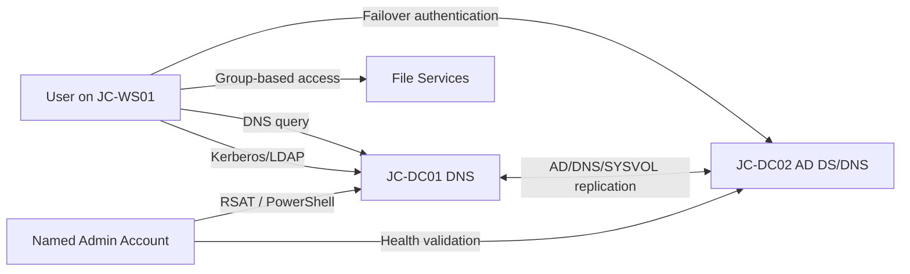

# Network and Authentication Flow

## Subnets
- Server subnet: `10.20.0.0/24`
- Client subnet: `10.20.10.0/24`
- Default gateway: `.1` in each subnet
- NTP authority: PDC Emulator synchronizes with an external approved source; domain members follow the domain hierarchy.
