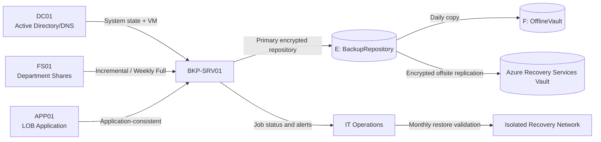

# Backup Architecture

## Trust Boundaries

1. Production servers can write only through the backup service.
2. Standard administrators cannot delete offsite recovery points.
3. Offline vault media is mounted only during controlled copy windows.
4. Recovery tests occur on an isolated network to prevent duplicate identity or IP conflicts.

## Data Flow

1. Protected workloads create application-consistent snapshots.
2. Backup data is written to the encrypted primary repository.
3. A daily copy job writes the newest verified recovery point to offline storage.
4. Encrypted recovery points replicate offsite.
5. Monitoring scripts validate age, size, status, and checksum evidence.
6. Restore tests prove recoverability and record elapsed recovery time.
