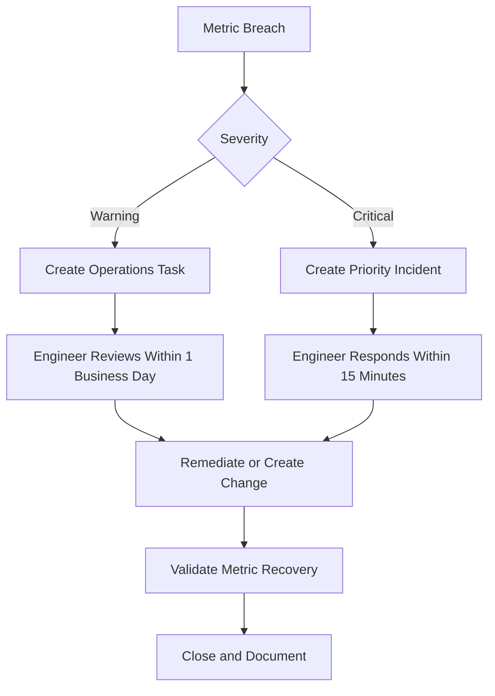

# Alert Escalation Flow

```mermaid
flowchart TD
  A[Metric Breach] --> B{Severity}
  B -- Warning --> C[Create Operations Task]
  B -- Critical --> D[Create Priority Incident]
  C --> E[Engineer Reviews Within 1 Business Day]
  D --> F[Engineer Responds Within 15 Minutes]
  E --> G[Remediate or Create Change]
  F --> G
  G --> H[Validate Metric Recovery]
  H --> I[Close and Document]
```
