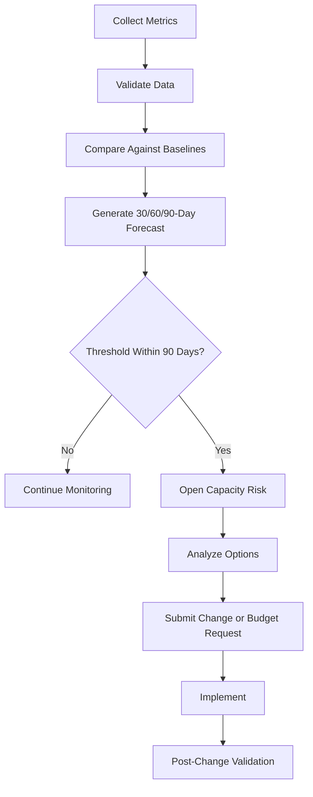

# Capacity Management Workflow

```mermaid
flowchart TD
  A[Collect Metrics] --> B[Validate Data]
  B --> C[Compare Against Baselines]
  C --> D[Generate 30/60/90-Day Forecast]
  D --> E{Threshold Within 90 Days?}
  E -- No --> F[Continue Monitoring]
  E -- Yes --> G[Open Capacity Risk]
  G --> H[Analyze Options]
  H --> I[Submit Change or Budget Request]
  I --> J[Implement]
  J --> K[Post-Change Validation]
```
