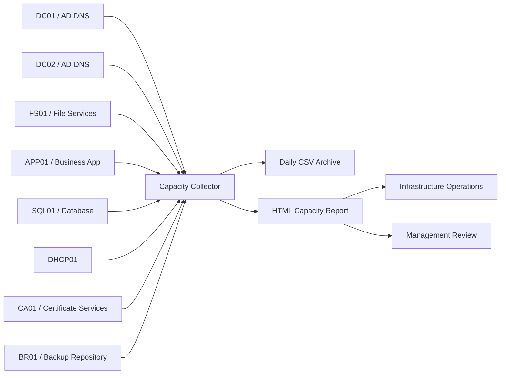

# Infrastructure Capacity Topology

```mermaid
flowchart LR
  DC1[DC01 / AD DNS] --> COL[Capacity Collector]
  DC2[DC02 / AD DNS] --> COL
  FS[FS01 / File Services] --> COL
  APP[APP01 / Business App] --> COL
  SQL[SQL01 / Database] --> COL
  DHCP[DHCP01] --> COL
  CA[CA01 / Certificate Services] --> COL
  BR[BR01 / Backup Repository] --> COL
  COL --> CSV[Daily CSV Archive]
  COL --> REP[HTML Capacity Report]
  REP --> OPS[Infrastructure Operations]
  REP --> MGMT[Management Review]
```
