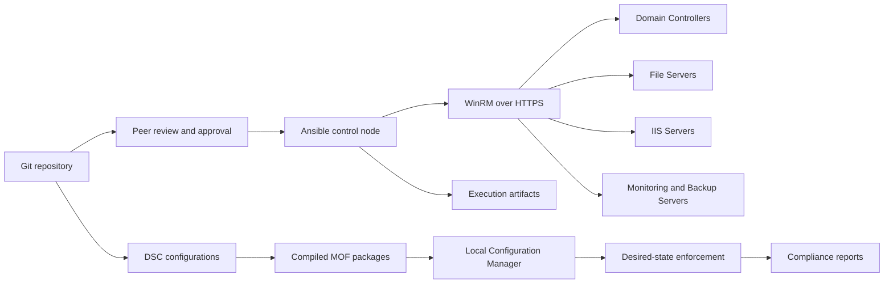

# Configuration Management Architecture

The control node performs orchestration while DSC enforces durable Windows state. Git provides version history, reviewability, and rollback points. Evidence is retained separately from source code and excludes credentials.
