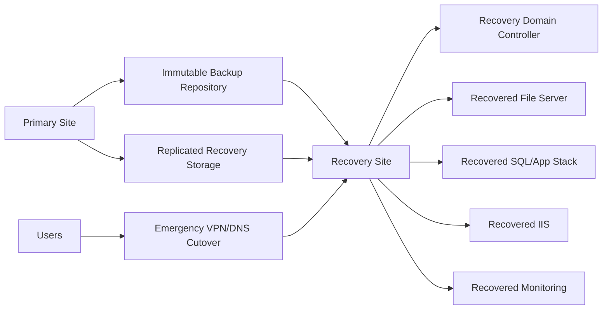

# Recovery Architecture

```mermaid
flowchart LR
  P[Primary Site] --> B[Immutable Backup Repository]
  P --> R[Replicated Recovery Storage]
  B --> S[Recovery Site]
  R --> S
  S --> DC[Recovery Domain Controller]
  S --> FS[Recovered File Server]
  S --> SQL[Recovered SQL/App Stack]
  S --> WEB[Recovered IIS]
  S --> MON[Recovered Monitoring]
  U[Users] --> VPN[Emergency VPN/DNS Cutover] --> S
```

The recovery site maintains reserved compute, segmented recovery networks, pre-created firewall objects, and isolated administrative credentials.
