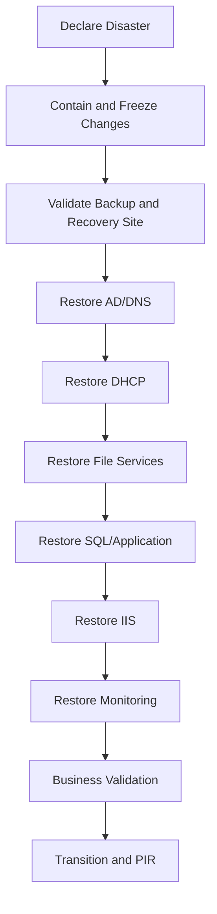

# Recovery Sequence

```mermaid
flowchart TD
 A[Declare Disaster] --> B[Contain and Freeze Changes]
 B --> C[Validate Backup and Recovery Site]
 C --> D[Restore AD/DNS]
 D --> E[Restore DHCP]
 E --> F[Restore File Services]
 F --> G[Restore SQL/Application]
 G --> H[Restore IIS]
 H --> I[Restore Monitoring]
 I --> J[Business Validation]
 J --> K[Transition and PIR]
```
