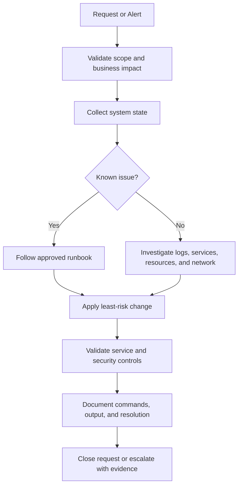

# Linux Administration Workflow

## Change Discipline

- Record the original state before making changes.
- Prefer reversible changes.
- Back up configuration files before editing.
- Use `visudo` for sudo policy validation.
- Use `sshd -t` before restarting SSH.
- Use `systemd-analyze verify` for unit-file validation.
- Confirm that monitoring, logging, and backups remain operational.
