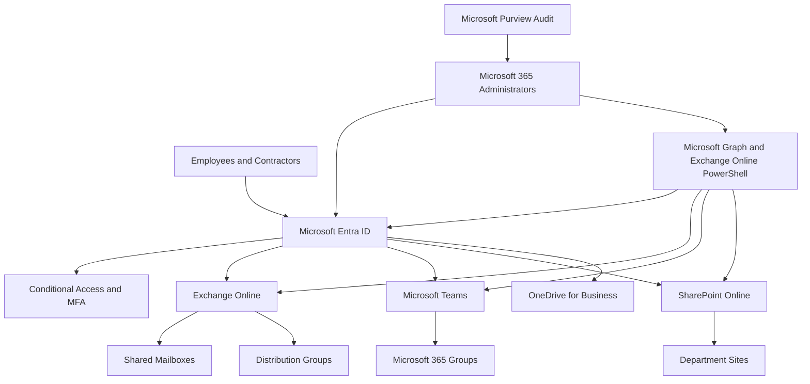

# Microsoft 365 Tenant Architecture

## Security Boundaries

- Individual administrator accounts are separate from daily-use accounts.
- Administrative roles are assigned by job requirement.
- MFA is required for all users and administrators.
- Legacy authentication is blocked.
- Guest access is reviewed regularly.
- Shared mailboxes do not use direct sign-in.
- Access is group-based wherever practical.
