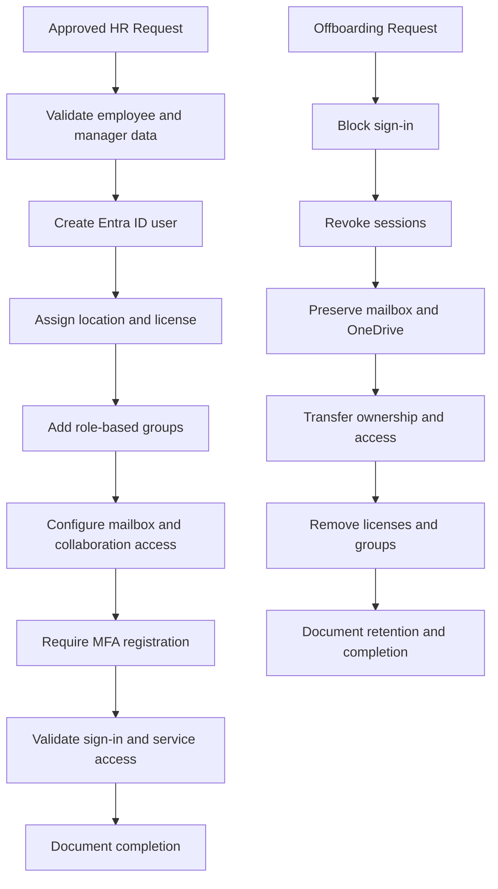

# Microsoft 365 User Lifecycle Workflow

## Control Principles

- Every lifecycle action starts with an approved request.
- Access is assigned from role templates, not personal preference.
- Sensitive changes require verification and logging.
- Offboarding blocks access before data transfer work begins.
- Validation is required before closure.
