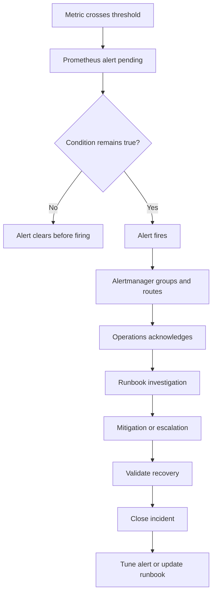

# Alert Lifecycle

```mermaid
flowchart TD
    A[Metric crosses threshold] --> B[Prometheus alert pending]
    B --> C{Condition remains true?}
    C -->|No| D[Alert clears before firing]
    C -->|Yes| E[Alert fires]
    E --> F[Alertmanager groups and routes]
    F --> G[Operations acknowledges]
    G --> H[Runbook investigation]
    H --> I[Mitigation or escalation]
    I --> J[Validate recovery]
    J --> K[Close incident]
    K --> L[Tune alert or update runbook]
```
