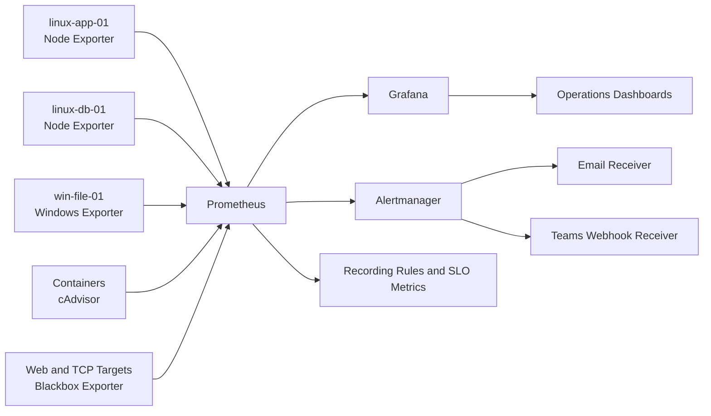

# Monitoring Architecture

## Operational Flow

1. Exporters expose platform metrics.
2. Prometheus scrapes and stores time-series data.
3. Recording rules precompute frequently used queries.
4. Alert rules evaluate operational conditions.
5. Alertmanager groups, routes, suppresses, and escalates alerts.
6. Grafana visualizes infrastructure, application, and SLO health.
7. Runbooks guide response and validation.
