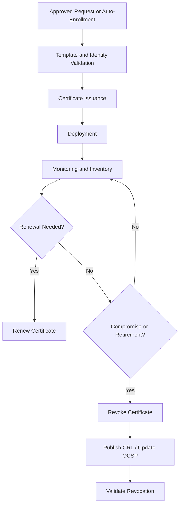

# Certificate Lifecycle Workflow

```mermaid
flowchart TD
    A[Approved Request or Auto-Enrollment] --> B[Template and Identity Validation]
    B --> C[Certificate Issuance]
    C --> D[Deployment]
    D --> E[Monitoring and Inventory]
    E --> F{Renewal Needed?}
    F -->|Yes| G[Renew Certificate]
    F -->|No| H{Compromise or Retirement?}
    H -->|Yes| I[Revoke Certificate]
    I --> J[Publish CRL / Update OCSP]
    J --> K[Validate Revocation]
    H -->|No| E
```
