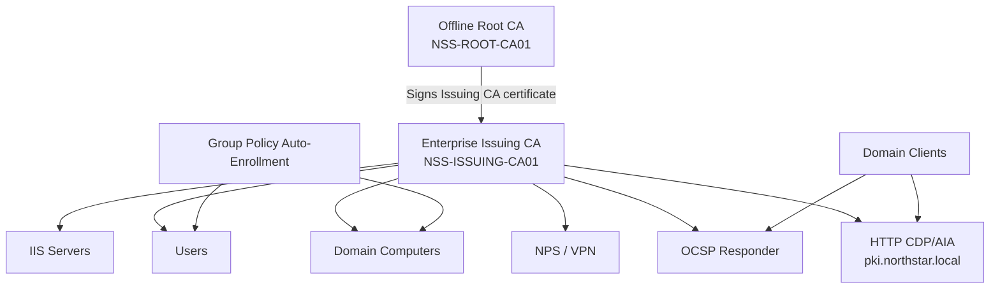

# Enterprise PKI Architecture

## Trust Model

- Root CA remains offline and workgroup-based.
- Issuing CA is domain-joined and handles day-to-day issuance.
- Root and Issuing CA private keys are backed up and access-controlled.
- CRLs and CA certificates are published over HTTP.
- OCSP provides near-real-time revocation status.
- Certificate templates enforce least privilege and approved EKUs.
