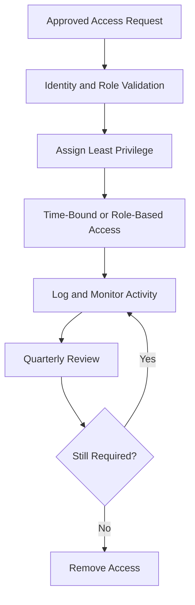

# Privileged Access Workflow

```mermaid
flowchart TD
    A[Approved Access Request] --> B[Identity and Role Validation]
    B --> C[Assign Least Privilege]
    C --> D[Time-Bound or Role-Based Access]
    D --> E[Log and Monitor Activity]
    E --> F[Quarterly Review]
    F --> G{Still Required?}
    G -->|Yes| E
    G -->|No| H[Remove Access]
```
