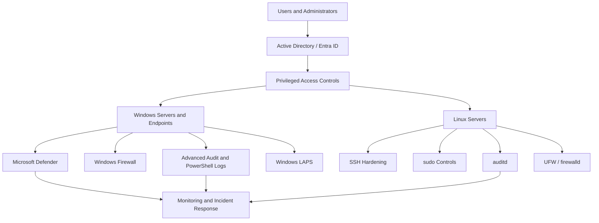

# Security Control Architecture

```mermaid
flowchart TB
    USERS[Users and Administrators] --> ID[Active Directory / Entra ID]
    ID --> PAM[Privileged Access Controls]
    PAM --> WIN[Windows Servers and Endpoints]
    PAM --> LNX[Linux Servers]
    WIN --> DEF[Microsoft Defender]
    WIN --> WFW[Windows Firewall]
    WIN --> AUD[Advanced Audit and PowerShell Logs]
    WIN --> LAPS[Windows LAPS]
    LNX --> SSH[SSH Hardening]
    LNX --> SUDO[sudo Controls]
    LNX --> AUDITD[auditd]
    LNX --> LFW[UFW / firewalld]
    DEF --> MON[Monitoring and Incident Response]
    AUD --> MON
    AUDITD --> MON
```
