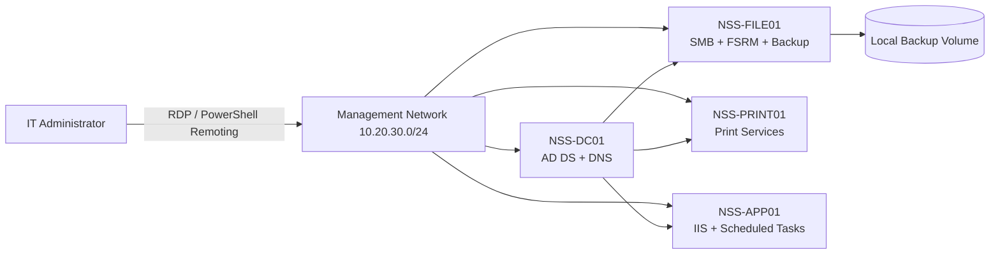

# Enterprise Windows Server Administration Lab

A production-style Windows Server 2022 portfolio project demonstrating the design, deployment, hardening, operation, automation, troubleshooting, and validation of a four-server Active Directory environment for Northstar Services.

> **Lab disclosure:** All systems, users, incidents, addresses, logs, and business records in this repository are simulated for portfolio demonstration. No production credentials or confidential data are included.

## Business Scenario

Northstar Services is a 75-user professional-services company replacing ad-hoc workgroup servers with a standardized Windows Server environment. The business requires centralized identity, resilient file services, controlled printing, a dedicated application host, auditable administration, recoverable backups, and repeatable support procedures.

## Objectives

- Deploy and document four Windows Server 2022 systems.
- Standardize naming, addressing, roles, storage, and security controls.
- Implement SMB shares with least-privilege NTFS and share permissions.
- Harden RDP, Windows Firewall, SMB, local administration, and audit policy.
- Automate health checks, role validation, backup validation, and reporting.
- Demonstrate incident response, change control, rollback, and evidence collection.
- Validate the environment with PowerShell and Pester tests.

## Environment

| Server | IP address | Primary roles | Key storage |
|---|---:|---|---|
| `NSS-DC01` | `10.20.30.10` | AD DS, DNS | OS 80 GB |
| `NSS-FILE01` | `10.20.30.20` | File Services, FSRM, Windows Server Backup | OS 80 GB, Data 250 GB, Backup 300 GB |
| `NSS-PRINT01` | `10.20.30.30` | Print and Document Services | OS 80 GB |
| `NSS-APP01` | `10.20.30.40` | IIS, scheduled application tasks | OS 100 GB, AppData 100 GB |

- Domain: `northstar.local`
- NetBIOS: `NORTHSTAR`
- Management subnet: `10.20.30.0/24`
- Default gateway: `10.20.30.1`
- DNS: `10.20.30.10`
- Time source: domain hierarchy

## Architecture



See [architecture/logical-architecture.md](architecture/logical-architecture.md) and [architecture/network-and-data-flow.md](architecture/network-and-data-flow.md).

## Implemented Controls

| Control | Implementation | Validation |
|---|---|---|
| Least privilege | Role-based AD groups mapped to NTFS access | `Test-WindowsServerBaseline.ps1`, ACL evidence |
| Secure remote administration | NLA required; RDP limited to management subnet | Firewall and registry checks |
| Host firewall | All profiles enabled; scoped inbound rules | Baseline script and evidence |
| SMB hardening | SMBv1 removed; signing required where applicable | Configuration inventory |
| Auditability | Advanced audit policy and PowerShell logging | Event-log report |
| Recovery | Daily system-state/data backups; quarterly restore test | Backup freshness and restore evidence |
| Patch governance | Monthly maintenance window and pre/post checks | Patch compliance report |
| Repeatability | PowerShell deployment and validation scripts | Pester suite |

## Repository Map

| Folder | Purpose |
|---|---|
| `architecture/` | Logical design, network flows, and control boundaries |
| `changes/` | Completed change records with risk, testing, and rollback |
| `configuration/` | Server inventory, standards, role matrix, and security baseline |
| `documentation/` | Build guide, operations handbook, and evidence matrix |
| `evidence/` | Sanitized lab outputs proving configuration and validation |
| `incidents/` | End-to-end incident records with timelines and root cause |
| `powershell/` | Production-style administration and validation scripts |
| `reports/` | Health, backup, patch, and operational KPI reports |
| `runbooks/` | Step-by-step operational procedures |
| `tests/` | Pester tests and test execution instructions |

## Automation

```powershell
# Run a full environment health check
.\powershell\Get-ServerHealth.ps1 -ComputerName NSS-DC01,NSS-FILE01,NSS-PRINT01,NSS-APP01 -OutputPath .\reports\generated

# Validate baseline controls
.\powershell\Test-WindowsServerBaseline.ps1 -ComputerName NSS-FILE01 -ExportPath .\evidence\baseline-NSS-FILE01.json

# Validate backup freshness
.\powershell\Test-BackupFreshness.ps1 -ComputerName NSS-FILE01 -MaximumAgeHours 26

# Run Pester tests
Invoke-Pester .\tests -Output Detailed
```

## Operational Outcomes

The completed lab achieved:

- 4 of 4 servers passing required role and firewall checks.
- 100% of defined SMB shares mapped to approved security groups.
- Backup recovery point age below the 26-hour operational threshold.
- Successful restore of a deleted test document in 11 minutes.
- Mean incident resolution time of 34 minutes across documented incidents.
- 0 unresolved high-severity baseline findings after remediation.

## Featured Artifacts

- [Administration Guide](administration-guide.md)
- [Build and Configuration Guide](documentation/build-and-configuration-guide.md)
- [Security Baseline](configuration/security-baseline.md)
- [Requirements-to-Evidence Matrix](documentation/requirements-evidence-matrix.md)
- [File Share Access Runbook](runbooks/file-share-access.md)
- [Failed Backup Incident](incidents/INC-2026-0714-backup-failure.md)
- [Server Health Script](powershell/Get-ServerHealth.ps1)
- [Baseline Validation Script](powershell/Test-WindowsServerBaseline.ps1)
- [Pester Test Suite](tests/WindowsServer.Tests.ps1)

## Skills Demonstrated

Windows Server 2022, Active Directory, DNS, SMB, NTFS permissions, FSRM, Print Services, IIS, Windows Server Backup, Event Viewer, Task Scheduler, Windows Firewall, RDP/NLA, certificates, patching, PowerShell remoting, Pester, incident management, change management, recovery testing, operational reporting, and technical documentation.
