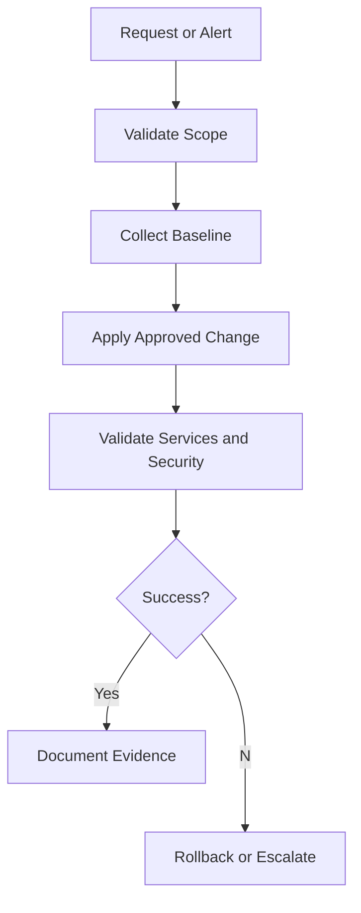

# Administration Workflow

```mermaid
flowchart TD
 A[Request or Alert]-->B[Validate Scope]
 B-->C[Collect Baseline]
 C-->D[Apply Approved Change]
 D-->E[Validate Services and Security]
 E-->F{Success?}
 F--Yes-->G[Document Evidence]
 F--No-->H[Rollback or Escalate]
```
