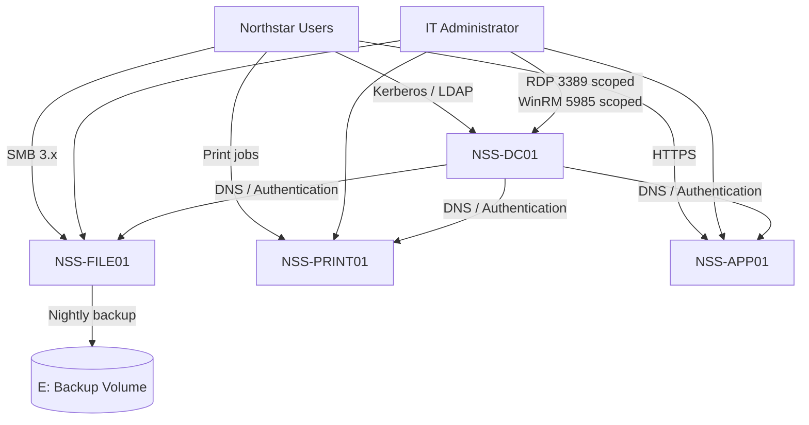

# Logical Architecture

## Design Principles

The environment separates identity, file, print, and application workloads to reduce blast radius, simplify troubleshooting, and make role ownership clear. All servers reside on the dedicated management subnet and use the domain controller for DNS.

## Trust Boundaries

1. **User boundary:** standard users access only published services.
2. **Administrative boundary:** management traffic is restricted to `10.20.30.0/24`.
3. **Identity boundary:** `NSS-DC01` provides authentication and DNS; no application data is hosted there.
4. **Recovery boundary:** backup data is isolated on a separate volume and protected by administrator-only ACLs.

## Availability Considerations

This portfolio lab uses single instances. Production recommendations include a second domain controller, clustered or cloud-backed file services, redundant print services where justified, off-host immutable backups, centralized monitoring, and separate privileged access workstations.
